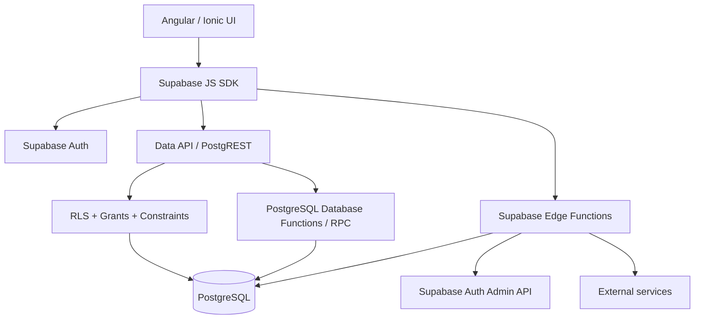
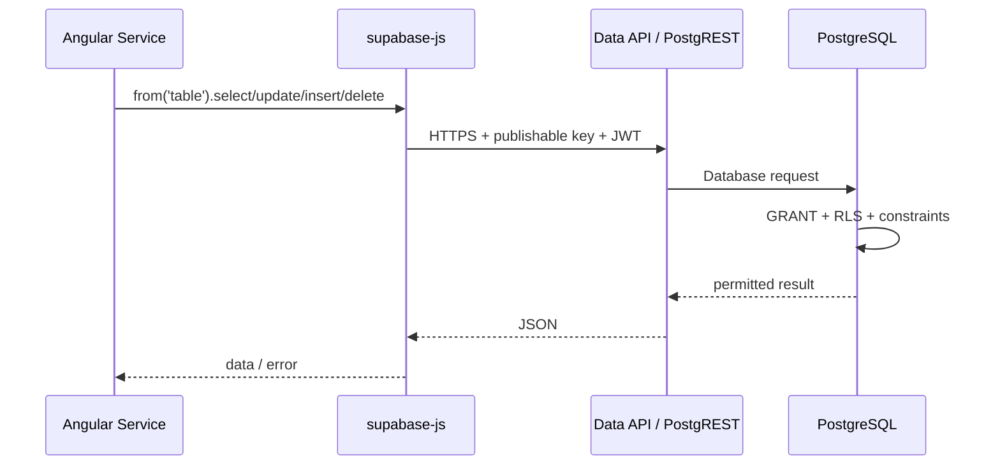
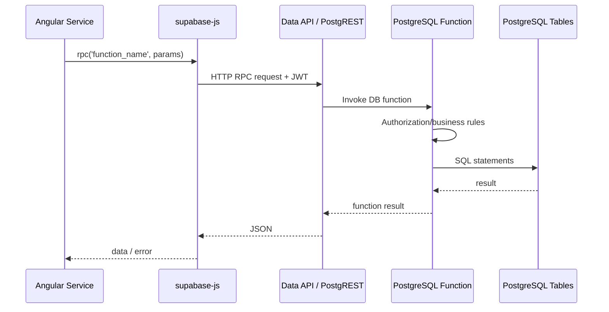
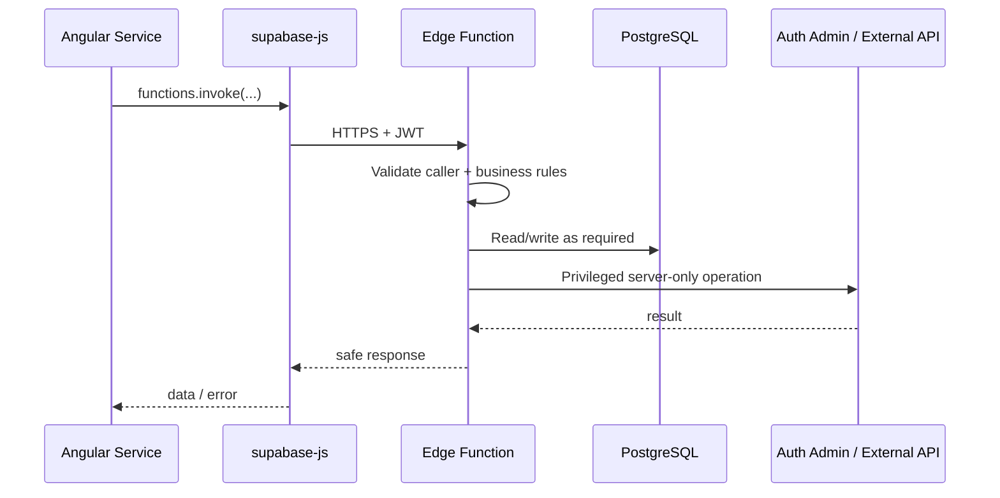

# Supabase Client-to-Database Architecture in Qurio

> **Recommended repository location:** `docs-2/14-SUPABASE-CLIENT-DATABASE-FLOW.md`
>
> This document explains how Qurio can read and write PostgreSQL data from an Angular/Ionic client without running a traditional custom backend such as Node.js, Java, .NET, or PHP. It also explains when Qurio **does** need server-side code, how Supabase Database Functions and Edge Functions differ, and the security role of RLS.

---

## 1. The most important idea: Qurio does have a backend

It is common to say:

> "Qurio has no backend. Angular talks directly to the database."

That is not quite correct.

Qurio does **not maintain its own traditional application server**, but there is still a backend. Supabase provides it.

The architecture is closer to:

```text
Angular / Ionic Qurio app
        |
        | HTTPS
        v
Supabase APIs
        |
        +-- Auth
        +-- Data API / PostgREST
        +-- PostgreSQL Database
        +-- Database Functions / RPC
        +-- Edge Functions
        +-- Storage (if used)
        +-- Realtime (if used)
```

The Angular application does **not** open a PostgreSQL connection.

The Angular application does **not** know the database password.

The Angular application does **not** send arbitrary SQL such as:

```sql
select * from profiles;
```

Instead, `@supabase/supabase-js` sends HTTPS API requests to Supabase. Supabase translates allowed API operations into PostgreSQL queries and executes them on the server.

This means Qurio is better described as:

```text
Client-heavy application
+
Backend-as-a-Service (Supabase)
```

rather than:

```text
Angular directly connected to PostgreSQL
```

---

## 2. What BaaS means

**BaaS** = **Backend as a Service**

A traditional application might have:

```text
Angular
   |
   v
Node.js / Java / .NET API
   |
   v
PostgreSQL
```

With Supabase, much of that application-server layer is already provided:

```text
Angular
   |
   v
Supabase Data API / Auth / RPC
   |
   v
PostgreSQL
```

For operations that need private secrets or elevated privileges, Qurio can add:

```text
Angular
   |
   v
Supabase Edge Function
   |
   v
PostgreSQL / Supabase Auth Admin / external service
```

So we avoid running and maintaining our own general-purpose backend server while still having a secure server-side architecture.

---

## 3. Qurio's Supabase client

Qurio creates one Supabase JavaScript client in:

```text
src/app/services/supabase.service.ts
```

Conceptually:

```ts
import { createClient } from '@supabase/supabase-js';

const supabase = createClient(environment.supabaseUrl, environment.supabaseKey);
```

Qurio also configures authentication session handling such as:

```ts
persistSession: true;
autoRefreshToken: true;
detectSessionInUrl: true;
```

The resulting Supabase client is reused by Angular services.

For example:

```text
AdminService
AuthService
learner-data services
other application services
        |
        v
SupabaseService.client
```

The page/component should normally deal with UI state while services deal with Supabase communication.

---

## 4. What is the Supabase URL?

A Supabase project has a project URL similar to:

```text
https://<project-ref>.supabase.co
```

The Supabase SDK uses this base URL to access services such as:

```text
/auth/v1/...        Supabase Auth
/rest/v1/...        Data API / PostgREST
/functions/v1/...   Edge Functions
/storage/v1/...     Storage
/realtime/v1/...    Realtime
```

The Angular app does not normally build these URLs manually. `supabase-js` does it.

---

## 5. What is the publishable/anon key?

The browser application needs a **public client key**.

Depending on the Supabase project's key generation/version, this may be described as a:

- publishable key, or
- legacy `anon` key.

This key identifies the Supabase project/API context. It is **not a database administrator password**.

It is expected that a browser user can inspect it.

Therefore security must **never** depend on hiding this key.

Correct model:

```text
Public/publishable key
        +
user JWT when signed in
        +
Postgres grants
        +
RLS policies
        =
safe client-accessible database API
```

Incorrect model:

```text
"The key is hidden in environment.ts,
therefore the database is secure."
```

Anything shipped in an Angular web bundle can eventually be inspected.

---

## 6. What must NEVER be in Angular?

Never put these into Angular/Ionic source or environment files:

```text
SUPABASE_SERVICE_ROLE_KEY
Supabase secret key
PostgreSQL database password
Resend API key
SMTP password
private third-party API secrets
```

The **service-role/secret key** is different from the browser publishable key.

It is privileged and can bypass normal client restrictions, including RLS in common Supabase service-role usage.

It belongs only in a trusted server environment such as a Supabase Edge Function.

---

## 7. How a normal SELECT works without our own backend

Consider this Angular service code:

```ts
const { data, error } = await supabase.from('profiles').select('*').eq('id', userId);
```

It looks somewhat like a database query, but the browser is not executing SQL.

The real flow is:

```text
Angular service
     |
     | supabase.from(...).select(...)
     v
supabase-js
     |
     | HTTPS request
     v
Supabase Data API
     |
     v
PostgREST
     |
     | constructs/executes database query
     v
PostgreSQL
     |
     +-- database grants checked
     +-- RLS policies checked
     +-- query executed
     |
     v
JSON response
     |
     v
Angular service
```

A simplified equivalent HTTP request might conceptually look like:

```text
GET /rest/v1/profiles?id=eq.<user-id>
```

The SDK builds requests like this for us.

PostgREST handles the database interaction on the server.

---

## 8. What is PostgREST?

**PostgREST** is a server that exposes PostgreSQL objects through a REST-style HTTP API.

Supabase's Data API is built around this approach.

Instead of writing a custom API route such as:

```text
GET /api/users/123
```

and then manually writing:

```sql
select * from profiles where id = $1;
```

Qurio can use:

```ts
supabase.from('profiles').select('*').eq('id', userId);
```

The Data API/PostgREST layer performs the server-side database request.

That is one major reason Supabase can remove a lot of routine CRUD backend code.

---

## 9. CRUD

**CRUD** means:

```text
C = Create
R = Read
U = Update
D = Delete
```

Typical Supabase client equivalents are:

### Create

```ts
await supabase.from('some_table').insert({
  user_id: userId,
  value: 'example',
});
```

Conceptually:

```sql
insert into some_table (...) values (...);
```

### Read

```ts
await supabase.from('some_table').select('*').eq('user_id', userId);
```

Conceptually:

```sql
select *
from some_table
where user_id = ...;
```

### Update

```ts
await supabase.from('some_table').update({ value: 'changed' }).eq('id', id);
```

Conceptually:

```sql
update some_table
set value = 'changed'
where id = ...;
```

### Delete

```ts
await supabase.from('some_table').delete().eq('id', id);
```

Conceptually:

```sql
delete from some_table
where id = ...;
```

Again, the conceptual SQL is executed in PostgreSQL on the server. The browser sends an API request.

---

## 10. Where does the SQL live?

Qurio still uses plenty of SQL.

The difference is that SQL used for schema and security is stored/deployed to PostgreSQL rather than embedded as arbitrary SQL inside Angular.

In Qurio, SQL migrations live under:

```text
supabase/migrations/
```

They define things such as:

```text
tables
columns
enums
foreign keys
indexes
RLS policies
database functions
triggers
grants
views
```

Examples of SQL responsibilities:

```sql
create table ...
alter table ...
create policy ...
create function ...
create trigger ...
grant ...
revoke ...
create index ...
```

The migration changes the database structure/behavior.

After deployment, Angular accesses only the database capabilities that were intentionally exposed.

---

## 11. The term you probably saw: RLS, not LRC

The abbreviation is most likely:

# RLS = Row Level Security

RLS is a PostgreSQL security feature.

It decides **which rows a caller may access**.

This is extremely important when a browser/mobile client communicates with Supabase directly.

Without RLS, trusting Angular code would be unsafe because a user can:

```text
inspect JavaScript
modify network requests
call Supabase APIs manually
bypass Angular route guards
change values in browser developer tools
```

RLS moves authorization into PostgreSQL, where the user cannot bypass it from Angular.

---

## 12. RLS example

Suppose `study_progress` contains:

```text
user_id
content_id
state
...
```

A policy can conceptually say:

```sql
create policy "Users read their own progress"
on public.study_progress
for select
to authenticated
using (
  auth.uid() = user_id
);
```

Then a malicious user could try:

```ts
supabase.from('study_progress').select('*');
```

But PostgreSQL effectively applies the policy.

The user sees only rows where:

```text
row.user_id == authenticated user's ID
```

RLS behaves somewhat like an automatically enforced security filter.

Conceptually:

```sql
select *
from study_progress
where user_id = auth.uid();
```

The important difference is that the client did not get to decide whether that filter was applied.

PostgreSQL enforced it.

---

## 13. `USING` and `WITH CHECK`

RLS commonly uses two important expressions.

### `USING`

Controls which existing rows are visible/targetable.

Typical operations:

```text
SELECT
UPDATE
DELETE
```

Example:

```sql
using (auth.uid() = user_id)
```

means:

```text
Only rows belonging to the caller may be selected/updated/deleted.
```

### `WITH CHECK`

Controls whether a newly inserted or updated row is allowed to exist.

Example:

```sql
with check (auth.uid() = user_id)
```

prevents this attack:

```text
User A inserts a row claiming:

user_id = User B
```

Even if Angular never sends such data, the database must enforce the rule.

---

## 14. Angular route guards are NOT database security

Qurio has Angular guards for navigation.

For example:

```text
approved user -> /home
Owner/Admin -> /admin/...
```

These are useful for UX.

But Angular guards are not enough for database security.

A malicious caller can bypass Angular entirely and call the Supabase API directly.

Therefore:

```text
Angular guard
= UI/navigation protection

RLS / RPC authorization / Edge Function authorization
= actual server-side security
```

Use both, but never confuse their responsibilities.

---

## 15. Auth and JWT

### Auth

**Auth** = Authentication

Authentication answers:

> Who is this user?

Supabase Auth handles:

```text
signup
email verification
login
session
password recovery
access tokens
```

### JWT

**JWT** = JSON Web Token

After successful authentication, Supabase gives the client a session containing tokens.

The access token is a JWT.

The client automatically includes the token in authorized Supabase requests.

Conceptual flow:

```text
User logs in
   |
   v
Supabase Auth validates credentials
   |
   v
JWT/access token returned
   |
   v
supabase-js stores session
   |
   v
future Data API request sends token
   |
   v
Postgres can identify caller
   |
   v
auth.uid()
```

The database can therefore use:

```sql
auth.uid()
```

inside RLS policies and Database Functions.

---

## 16. Authentication vs authorization

These are different.

### Authentication

```text
"Who are you?"
```

Example:

```text
Supabase Auth says this is user UUID abc-123.
```

### Authorization

```text
"What are you allowed to do?"
```

In Qurio authorization also depends on:

```text
profile.status
profile.role
RLS policies
Database Function checks
Edge Function checks
```

A verified/login-capable user is not automatically allowed to use all Qurio data.

For example:

```text
authenticated + pending
!=
approved learner
```

---

## 17. Qurio has two different kinds of roles

Do not confuse them.

### Supabase/Postgres API roles

Examples include:

```text
anon
authenticated
service_role
```

These are infrastructure/security roles.

### Qurio application roles

Stored in `public.profiles.role`:

```text
owner
admin
user
```

These are business/application roles.

For example:

```text
authenticated Postgres/API role
+
profiles.role = admin
+
profiles.status = approved
```

means an authenticated Qurio Admin.

---

## 18. `anon`

**anon** means the unauthenticated/public API role.

A request without a signed-in user may operate as `anon`.

Qurio should grant only what is genuinely safe for anonymous users.

Do not confuse:

```text
anon key
```

with:

```text
"anonymous user has unrestricted access"
```

The key identifies the public API context; grants and RLS still define what the caller can do.

---

## 19. `authenticated`

After Supabase validates a user's JWT, database API requests operate in the authenticated context.

That allows policies such as:

```sql
to authenticated
using (auth.uid() = user_id)
```

The caller is still not trusted automatically.

The authenticated role only means:

```text
Supabase recognizes the caller's valid session.
```

RLS still decides row-level access.

---

## 20. `service_role`

`service_role` is a highly privileged server-side role/key.

Use it only in trusted code.

For Qurio this belongs in:

```text
Supabase Edge Function environment/secrets
```

Never:

```text
Angular
GitHub Pages bundle
Capacitor web assets
environment.ts
environment.prod.ts
```

A service-role credential leaking into the client would defeat the security model.

---

## 21. Grants and RLS are different

Postgres authorization has multiple layers.

A useful mental model is:

```text
GRANT:
"May this database role use this table/function at all?"

RLS:
"If yes, which rows may it access?"
```

For example:

```sql
grant select on public.profiles to authenticated;
```

allows the authenticated role to attempt reads.

Then RLS might restrict it:

```text
normal user -> own profile
staff       -> more profiles
```

Both layers matter.

---

## 22. What is an RPC?

**RPC** = **Remote Procedure Call**

In Supabase, `.rpc(...)` usually means:

> Call a PostgreSQL Database Function remotely through the Data API.

Example from Qurio's architecture:

```ts
await supabase.rpc('admin_approve_user', {
  target_user_id: id,
});
```

The Angular application is not executing the SQL body.

The flow is:

```text
Angular
   |
   | supabase.rpc(...)
   v
Data API / PostgREST
   |
   | invokes PostgreSQL function
   v
PostgreSQL
   |
   | function runs SQL/PLpgSQL
   +-- authorization checks
   +-- updates rows
   +-- audit insert
   v
result
```

Conceptually the HTTP endpoint resembles:

```text
POST /rest/v1/rpc/admin_approve_user
```

---

## 23. Why use a Database Function / RPC?

A direct CRUD call is good when the operation is simple and RLS can express all rules safely.

Example:

```text
"Read my own bookmarks."
```

An RPC is useful when one business operation requires multiple database steps that should be controlled together.

Example:

```text
Approve user:

1. verify caller is Owner/Admin
2. verify target is a normal user
3. verify target email is confirmed
4. verify target status is pending
5. update status
6. store status_changed_by
7. store status_changed_at
8. write audit log
```

Rather than allowing Angular to perform eight loosely connected requests, a Database Function can perform the operation inside PostgreSQL.

Benefits include:

```text
centralized authorization
atomic database work
less duplicated client logic
consistent audit behavior
harder to bypass
```

---

## 24. PL/pgSQL

**PL/pgSQL** = **Procedural Language/PostgreSQL Structured Query Language**

Normal SQL is excellent for statements such as:

```sql
select ...
insert ...
update ...
delete ...
```

PL/pgSQL adds procedural features:

```text
variables
IF / ELSE
loops
exceptions
multiple statements
```

Qurio's more complex Database Functions can therefore implement business workflows close to the data.

Example shape:

```sql
create or replace function public.some_action(...)
returns void
language plpgsql
as $$
begin
  if ... then
    raise exception 'Not allowed';
  end if;

  update ...;
  insert ...;
end
$$;
```

---

## 25. `SECURITY INVOKER`

A PostgreSQL function normally runs as:

```text
SECURITY INVOKER
```

This means it runs with the permissions of the caller.

This is generally the safer default.

---

## 26. `SECURITY DEFINER`

A function declared:

```sql
security definer
```

runs using the privileges of the function owner rather than the caller.

This can be useful for controlled privileged workflows.

It is also dangerous if implemented incorrectly.

For a `SECURITY DEFINER` function, Qurio must:

```text
explicitly verify auth.uid()
explicitly verify caller role/status
validate the target
grant EXECUTE only to intended API roles
use a safe search_path
avoid dynamic unsafe SQL
```

Qurio migrations use patterns such as:

```sql
security definer
set search_path = ''
```

With an empty search path, referenced objects should be schema-qualified:

```sql
public.profiles
public.account_audit_log
```

This reduces search-path related security problems.

---

## 27. What is a trigger?

A **trigger** is database logic that automatically runs when a database event happens.

Typical events:

```text
INSERT
UPDATE
DELETE
```

Qurio uses the idea for Auth/profile synchronization.

Example lifecycle:

```text
Supabase Auth creates auth.users row
             |
             v
Postgres trigger fires
             |
             v
handle_new_auth_user()
             |
             v
public.profiles row created
```

Angular does not need to remember:

```text
"After signup, now manually insert profile."
```

The database enforces that behavior centrally.

Another trigger can respond when Auth email verification changes.

---

## 28. Why `auth.users` and `public.profiles` both exist

Supabase Auth owns internal authentication data under the Auth schema.

For application-specific information Qurio keeps:

```text
public.profiles
```

Typical split:

```text
auth.users
-----------
identity
email
password/auth metadata
email confirmation
Auth-managed fields

public.profiles
---------------
display name
Qurio role
Qurio account status
approval metadata
application-specific information
```

`profiles.id` references the Auth user's UUID.

This gives Qurio application data without trying to use Auth's internal table as the application's general profile table.

---

## 29. What is an Edge Function?

A Supabase **Edge Function** is server-side TypeScript code.

Supabase Edge Functions use a Deno-compatible runtime.

Flow:

```text
Angular
   |
   | HTTPS / functions.invoke(...)
   v
Supabase Edge Function
   |
   +-- validates caller
   +-- can access server-only secret
   +-- performs privileged operation
   |
   v
Supabase services / external API
```

Unlike a Database Function, an Edge Function does not run inside PostgreSQL.

It is server-side application code.

---

## 30. Deno

**Deno** is a JavaScript/TypeScript runtime.

In simple terms:

```text
Browser -> JavaScript runtime in browser
Node.js -> server-side JS/TS runtime
Deno    -> another JS/TS runtime used by Supabase Edge Functions
```

Qurio Edge Functions are TypeScript files such as:

```text
supabase/functions/admin-delete-user/index.ts
```

---

## 31. Database Function vs Edge Function

This distinction is important.

### Database Function / RPC

Runs:

```text
inside PostgreSQL
```

Good for:

```text
data-heavy operations
atomic database changes
database authorization workflows
aggregations
business rules close to data
```

Example:

```text
admin_approve_user
owner_promote_admin
owner_demote_admin
submit_quiz_attempt
```

### Edge Function

Runs:

```text
server-side TypeScript outside PostgreSQL
```

Good for:

```text
Supabase Auth Admin API
server-only secrets
external APIs
Resend/other integrations
webhooks
complex HTTP workflows
cross-service orchestration
```

Example:

```text
admin-delete-user
admin-resend-verification
```

---

## 32. Why deleting a Supabase Auth user needs an Edge Function

A browser user must not receive Auth Admin privileges.

Angular should therefore NOT do something like:

```text
service-role key
+
admin.auth.admin.deleteUser(...)
```

Instead:

```text
Angular
   |
   | authenticated request
   v
Edge Function
   |
   +-- validates JWT
   +-- checks Qurio role/status
   +-- uses server-side service-role key
   +-- writes audit entry
   +-- deletes Auth user
   v
response
```

The secret stays on the server.

---

## 33. Why some writes use direct client calls and others use RPC/Edge Functions

There is no single rule saying:

```text
"Never write to the database from Angular."
```

The better rule is:

```text
Use the least-privileged mechanism that can safely enforce the rule.
```

A useful decision table for Qurio:

| Operation                            | Recommended mechanism   | Why                                |
| ------------------------------------ | ----------------------- | ---------------------------------- |
| Read own profile                     | Data API + RLS          | Simple row read                    |
| Read own progress                    | Data API + RLS          | User-scoped data                   |
| Save simple own setting              | Data API + RLS          | RLS can safely restrict owner      |
| Read Admin-visible profiles          | Data API + RLS          | Staff authorization enforced in DB |
| Approve user                         | Database Function / RPC | Multiple business rules + audit    |
| Promote Admin                        | Database Function / RPC | Role rules and max-admin rule      |
| Submit quiz result                   | Database Function / RPC | Validation + multi-row insert      |
| Delete Auth user                     | Edge Function           | Requires Auth Admin privilege      |
| Resend verification for another user | Edge Function           | Staff authorization + Auth API     |
| Call external service with secret    | Edge Function           | Secret must not reach client       |

---

## 34. Four main paths Qurio uses

A helpful mental model is that Qurio has four backend interaction paths.

### Path A — Auth API

```text
Angular
  -> Supabase Auth
```

Used for:

```text
signup
sign in
sign out
verify OTP/link
resend own verification
password recovery
session refresh
```

### Path B — Data API

```text
Angular
  -> supabase-js
  -> PostgREST/Data API
  -> PostgreSQL
  -> grants + RLS
```

Used for normal permitted CRUD.

### Path C — Database Function / RPC

```text
Angular
  -> supabase.rpc(...)
  -> Data API
  -> PostgreSQL function
```

Used for controlled database workflows.

### Path D — Edge Function

```text
Angular
  -> supabase.functions.invoke(...)
  -> Edge Function
  -> privileged Supabase/external operation
```

Used for operations that must happen in trusted server-side code.

---

## 35. Example from Qurio: listing profiles

Qurio's `AdminService` contains a pattern similar to:

```ts
const { data, error } = await this.supabase.from('profiles').select('*').order('created_at', { ascending: false });
```

This is a Data API operation.

Angular is asking for rows.

The database remains responsible for determining whether the authenticated caller is permitted to see those rows.

The client should not be trusted merely because this method exists only on the Admin page.

---

## 36. Example from Qurio: updating your own profile through RPC

Qurio currently calls a PostgreSQL function for profile changes:

```ts
await this.supabase.rpc('update_my_profile', {
  display_name: displayName,
});
```

This gives PostgreSQL control over:

```text
who is changing the profile
which profile may be changed
input validation
which columns may change
```

The client does not send:

```text
target user UUID chosen by the browser
+
unrestricted profile UPDATE
```

This is an example of moving an important business rule into the database.

---

## 37. Example from Qurio: deleting another account

Qurio uses:

```ts
this.supabase.functions.invoke('admin-delete-user', {
  body: {
    targetUserId: id,
    reason,
  },
});
```

The Edge Function then:

```text
validates bearer token
loads caller profile
requires approved Owner/Admin
loads target profile
applies Owner/Admin deletion restrictions
writes audit entry
uses Auth Admin API
deletes user
```

That is server-side privileged logic even though Qurio does not operate a traditional Node/Java backend.

---

## 38. JWT flow through Data API

A simplified signed-in database request looks like:

```text
Angular
  |
  | publishable key
  | Authorization: Bearer <JWT>
  v
Supabase API
  |
  v
PostgreSQL request context
  |
  +-- role = authenticated
  +-- auth.uid() = signed-in user's UUID
  |
  v
RLS evaluates policies
```

The JWT is therefore not just "proof that login worked."

It provides identity context used during authorization.

---

## 39. Why we still assume the browser is hostile

Even when Angular code is ours, the runtime belongs to the user.

A user can:

```text
open DevTools
copy the Supabase project URL
copy the publishable key
inspect network calls
create their own HTTP request
modify JavaScript execution
call REST endpoints outside our UI
```

This is expected.

Security therefore must be correct even if the Qurio UI is completely bypassed.

That is why this architecture depends on:

```text
RLS
database grants
secure RPC functions
Edge Function authorization
server-only secrets
```

---

## 40. SQL Editor vs Angular client

Supabase Dashboard has a SQL Editor.

The SQL Editor is an administrative/development tool.

When we execute:

```sql
update public.profiles
set status = 'approved'
where ...;
```

in SQL Editor, we are directly running SQL against PostgreSQL with elevated project/database privileges.

That is completely different from Angular using:

```ts
supabase
  .from('profiles')
  .update(...);
```

The Angular request goes through the Data API and caller permissions/RLS.

Do not use SQL Editor behavior as proof that a browser user can perform the same operation.

---

## 41. Migration

A **migration** is a versioned database change.

Examples:

```text
001_qurio_auth_foundation.sql
002_qurio_admin_control.sql
...
```

A migration may create/change:

```text
schema
tables
columns
indexes
policies
functions
triggers
constraints
grants
```

Migrations should be treated as append-only history once applied.

If migration `008` has been executed and later needs a correction, prefer:

```text
009 / 010 / next migration
```

rather than silently rewriting historical SQL that has already been applied.

---

## 42. DDL, DML, DCL and TCL

These SQL abbreviations are useful when reading migrations.

### DDL — Data Definition Language

Defines database structure.

Examples:

```sql
create table
alter table
drop table
create index
create function
```

### DML — Data Manipulation Language

Works with data.

Examples:

```sql
select
insert
update
delete
```

`SELECT` is sometimes separately described as **DQL** (Data Query Language), depending on terminology.

### DCL — Data Control Language

Controls permissions.

Examples:

```sql
grant
revoke
```

### TCL — Transaction Control Language

Controls transactions.

Examples:

```sql
begin
commit
rollback
```

---

## 43. Transaction

A database **transaction** groups changes into one logical unit.

Example:

```sql
begin;

update ...;
insert into audit_log ...;

commit;
```

If designed correctly, either the whole operation succeeds or it is rolled back.

This is one reason Database Functions are useful for important multi-step database workflows.

---

## 44. PK and FK

### PK — Primary Key

Uniquely identifies a row.

Example:

```text
profiles.id
```

### FK — Foreign Key

Links a row to another table.

Example:

```text
profiles.id
  -> auth.users.id
```

A foreign key helps PostgreSQL enforce referential integrity.

---

## 45. `ON DELETE CASCADE`

A foreign key may specify:

```sql
on delete cascade
```

Meaning:

```text
delete parent row
  ->
automatically delete dependent child rows
```

Qurio uses this pattern for user-owned learning state.

Therefore when a trusted server-side operation deletes an Auth user, related Qurio rows can be cleaned up by database relationships rather than Angular manually deleting every table.

---

## 46. Index

An **index** helps PostgreSQL locate rows efficiently.

Example:

```sql
create index profiles_status_idx
on public.profiles(status);
```

Indexes are primarily performance structures.

They are not replacements for RLS or constraints.

---

## 47. Constraint

A database **constraint** enforces valid data.

Examples:

```text
NOT NULL
UNIQUE
CHECK
PRIMARY KEY
FOREIGN KEY
```

Example:

```sql
check (score_percent between 0 and 100)
```

Even if Angular has form validation, database constraints still matter because callers can bypass Angular.

---

## 48. API

**API** = **Application Programming Interface**

It is a defined way for software components to communicate.

In Qurio:

```text
Angular -> Supabase Auth API
Angular -> Supabase Data API
Angular -> Edge Function HTTP API
```

---

## 49. REST

**REST** = **Representational State Transfer**

It is a common style for HTTP APIs.

Supabase/PostgREST exposes database resources using HTTP semantics.

Typical concepts include:

```text
GET     read
POST    create/call
PATCH   update
DELETE  delete
```

`supabase-js` gives Qurio a convenient JavaScript abstraction over these calls.

---

## 50. SDK

**SDK** = **Software Development Kit**

`@supabase/supabase-js` is Supabase's JavaScript SDK.

Instead of manually building HTTP headers and REST URLs, Qurio writes:

```ts
supabase.from(...)
supabase.rpc(...)
supabase.auth...
supabase.functions.invoke(...)
```

The SDK handles the protocol details.

---

## 51. CORS

**CORS** = **Cross-Origin Resource Sharing**

Browsers enforce origin rules for HTTP requests.

Edge Functions commonly return CORS headers such as:

```text
Access-Control-Allow-Origin
Access-Control-Allow-Headers
Access-Control-Allow-Methods
```

This is necessary so a browser-hosted Qurio app can call the Edge Function.

CORS is **not authorization**.

A permissive CORS rule does not mean an operation is safe.

The function must still validate:

```text
JWT
role
status
target
business rules
```

---

## 52. SMTP

**SMTP** = **Simple Mail Transfer Protocol**

Qurio uses Supabase Auth with an email provider such as Resend for outgoing authentication email.

Examples:

```text
verify email
password recovery
```

Supabase manages the Auth token/link workflow while SMTP is the delivery mechanism.

---

## 53. OTP

**OTP** = **One-Time Password** or one-time verification token/code.

Supabase Auth uses OTP/token concepts for several email authentication flows.

Qurio's callback code can verify/exchange the token and establish a valid session.

---

## 54. UUID

**UUID** = **Universally Unique Identifier**

Supabase Auth users use UUID identifiers.

Qurio uses the Auth user's UUID to link records such as:

```text
profiles.id
study_progress.user_id
quiz_attempts.user_id
```

Do not use email as the permanent relational identity of a user.

Email may change; the UUID is the stable identifier.

---

## 55. RBAC

**RBAC** = **Role-Based Access Control**

Authorization depends on the user's role.

Qurio has an application-level RBAC model:

```text
owner
admin
user
```

Examples:

```text
Owner -> manage Admin role
Admin -> manage eligible user accounts
User  -> use learning features
```

RLS/Database Functions can incorporate these roles.

---

## 56. ABAC

**ABAC** = **Attribute-Based Access Control**

Authorization depends on attributes, not only role.

Qurio also uses ABAC-like checks.

Example:

```text
role = user
AND
status = approved
AND
email_verified_at IS NOT NULL
```

So Qurio's authorization is not purely RBAC.

It combines:

```text
identity
role
status
ownership
target state
```

---

## 57. Realtime

Supabase **Realtime** can subscribe to database changes and broadcast them to clients.

Conceptually:

```text
database row changes
      |
      v
Realtime service
      |
      v
subscribed browser/mobile app
```

Qurio does not need Realtime for every database operation.

Normal CRUD works without it.

Use Realtime only when the UI genuinely needs live server-pushed updates rather than refresh/reload behavior.

---

## 58. Storage

Supabase **Storage** is object/file storage.

It is separate from PostgreSQL tables but integrates with Supabase Auth and security policies.

Typical use cases:

```text
images
documents
user uploads
```

Do not store large binary files directly in ordinary Postgres rows when object storage is the better fit.

---

## 59. Edge vs database

The word **Edge** does not mean:

```text
runs inside Angular
```

It means server-side code is deployed to a distributed serverless runtime.

Similarly:

```text
Database Function
```

does not mean an Angular TypeScript function.

There are three very different meanings of "function" in this project:

```text
Angular/TypeScript function
    runs on the client

PostgreSQL Database Function
    runs inside Postgres

Supabase Edge Function
    runs server-side in Deno
```

Always identify which one is being discussed.

---

## 60. Qurio end-to-end example: loading learner data

Conceptual flow:

```text
Approved user opens Progress page
          |
          v
Angular service calls supabase.from(...)
          |
          v
supabase-js attaches current JWT
          |
          v
Data API / PostgREST
          |
          v
PostgreSQL
          |
          +-- GRANT permits operation?
          |
          +-- RLS:
          |     auth.uid() == user_id?
          |     profile approved?
          |
          v
Only permitted rows returned
          |
          v
Angular renders data
```

No Qurio-owned Node/Java backend is involved.

But server-side Supabase components absolutely are involved.

---

## 61. Qurio end-to-end example: Owner promotes an Admin

A safe design is:

```text
Owner clicks Promote
        |
        v
Angular calls AdminService
        |
        v
supabase.rpc('owner_promote_admin', ...)
        |
        v
PostgreSQL function
        |
        +-- auth.uid()
        +-- caller must be approved Owner
        +-- target must be approved User
        +-- maximum Admin count checked
        +-- role updated
        +-- audit inserted
        |
        v
result returned
```

The security decision is not made by:

```text
@if (auth.isOwner()) { show button }
```

That UI check is helpful but not authoritative.

The PostgreSQL function is authoritative.

---

## 62. Qurio end-to-end example: Admin deletes a user

```text
Admin clicks Delete
       |
       v
confirmation dialog
       |
       v
Angular invokes admin-delete-user
       |
       v
Edge Function receives JWT
       |
       +-- validate token
       +-- load actor profile
       +-- require approved staff
       +-- validate target
       +-- enforce Owner/Admin restrictions
       +-- write audit snapshot
       +-- service-role Auth Admin deletion
       |
       v
auth.users deleted
       |
       v
FK ON DELETE CASCADE
       |
       v
profile / owned learning rows removed
```

That operation needs server-side code because Auth Admin deletion is privileged.

---

## 63. When Qurio does NOT need an Edge Function

Do not create Edge Functions for every database read/write.

That would re-create a traditional API layer unnecessarily.

If all of these are true:

```text
operation is ordinary database CRUD
RLS can safely authorize it
no secret is needed
no Auth Admin API is needed
no third-party privileged API is needed
```

then direct Data API access from an Angular service is usually appropriate.

---

## 64. When Qurio SHOULD use RPC

Prefer a PostgreSQL Database Function/RPC when:

```text
several DB statements form one business operation
operation should be atomic
authorization belongs close to database state
complex validation must not be duplicated in client
audit + mutation should happen together
data-heavy calculation is naturally SQL-based
```

---

## 65. When Qurio SHOULD use an Edge Function

Prefer an Edge Function when:

```text
a private secret is required
Supabase Auth Admin API is required
a third-party API must be called securely
server-side HTTP orchestration is required
webhook endpoint is needed
database + Auth/external service must be coordinated
```

---

## 66. Why this architecture is secure even though the public client can call the database API

The goal is not to prevent users from calling the API.

They are expected to call it.

The goal is:

```text
Every possible API request is safe even if manually crafted.
```

This is accomplished with layers:

```text
1. Authentication
2. JWT
3. Postgres role
4. GRANT / REVOKE
5. RLS
6. constraints
7. Database Function authorization
8. Edge Function authorization
9. server-only secrets
10. audit logging
```

Angular is primarily the UX layer.

The backend rules remain authoritative.

---

## 67. Common mistakes to avoid

### Mistake 1

```text
"Nobody knows my publishable key."
```

Wrong assumption.

Treat it as public.

### Mistake 2

```text
"The Admin page is hidden, so normal users cannot call Admin APIs."
```

Wrong.

Server/database authorization must still reject them.

### Mistake 3

```text
"We have RLS, so the service-role key is safe in Angular."
```

Wrong.

Never ship it.

### Mistake 4

```text
"Angular validation prevents invalid data."
```

Not enough.

Use constraints and server-side validation.

### Mistake 5

```text
"Every write needs an Edge Function."
```

Not necessarily.

RLS-protected direct CRUD is one of Supabase's main strengths.

### Mistake 6

```text
"RPC means another HTTP backend service we must host."
```

No.

The function lives inside PostgreSQL and is exposed by the Supabase Data API.

### Mistake 7

```text
"RLS means LRC."
```

The correct abbreviation is:

```text
RLS = Row Level Security
```

---

## 68. Practical decision tree for Qurio development

When adding a feature, ask:

```text
Does this operation need a secret or Auth Admin API?
        |
       YES
        |
        v
Use Edge Function
```

Otherwise:

```text
Is it a multi-step/atomic database business operation?
        |
       YES
        |
        v
Use Database Function / RPC
```

Otherwise:

```text
Can ordinary table access be safely described with grants + RLS?
        |
       YES
        |
        v
Use supabase.from(...) from an Angular service
```

If the answer is no:

```text
reconsider the data model / RPC / Edge Function design
```

---

## 69. Recommended Angular layering

Prefer:

```text
Page / Component
     |
     v
Angular Service
     |
     v
SupabaseService
     |
     +-- Auth
     +-- Data API
     +-- RPC
     +-- Edge Function invocation
```

For example:

```text
AdminUsersPage
      |
      v
AdminService
      |
      +-- listProfiles()
      +-- approve()
      +-- demote()
      +-- deleteUser()
```

Avoid scattering raw Supabase calls throughout every component.

Benefits:

```text
easier testing
clearer responsibilities
consistent error handling
less duplicated logic
easier future refactoring
```

---

## 70. Qurio backend responsibility map



---

## 71. Request flow for normal CRUD



---

## 72. Request flow for RPC



---

## 73. Request flow for Edge Function



---

## 74. Important Qurio security boundary

A useful rule to remember:

```text
Everything before the server can be manipulated by the user.
```

That includes:

```text
Angular component
Angular service
form validation
route guard
button visibility
request body
local storage
session storage
Capacitor WebView UI
```

Therefore destructive or privileged authorization must ultimately be enforced by:

```text
PostgreSQL
or
Edge Function
```

---

## 75. Glossary

| Term                  | Expansion / meaning                                                       |
| --------------------- | ------------------------------------------------------------------------- |
| API                   | Application Programming Interface                                         |
| Auth                  | Authentication service                                                    |
| BaaS                  | Backend as a Service                                                      |
| CRUD                  | Create, Read, Update, Delete                                              |
| CORS                  | Cross-Origin Resource Sharing                                             |
| DB                    | Database                                                                  |
| DCL                   | Data Control Language                                                     |
| DDL                   | Data Definition Language                                                  |
| DML                   | Data Manipulation Language                                                |
| DQL                   | Data Query Language                                                       |
| Edge Function         | Server-side TypeScript function on Supabase Edge Runtime                  |
| FK                    | Foreign Key                                                               |
| HTTP                  | Hypertext Transfer Protocol                                               |
| HTTPS                 | HTTP over TLS encryption                                                  |
| JWT                   | JSON Web Token                                                            |
| MFA                   | Multi-Factor Authentication                                               |
| OTP                   | One-Time Password / one-time token                                        |
| PK                    | Primary Key                                                               |
| PL/pgSQL              | PostgreSQL procedural SQL language                                        |
| Postgres / PostgreSQL | Qurio's relational database                                               |
| PostgREST             | REST API server for PostgreSQL; central to Supabase Data API              |
| REST                  | Representational State Transfer                                           |
| RBAC                  | Role-Based Access Control                                                 |
| ABAC                  | Attribute-Based Access Control                                            |
| RLS                   | Row Level Security                                                        |
| RPC                   | Remote Procedure Call                                                     |
| SDK                   | Software Development Kit                                                  |
| SQL                   | Structured Query Language                                                 |
| SMTP                  | Simple Mail Transfer Protocol                                             |
| TLS                   | Transport Layer Security                                                  |
| UUID                  | Universally Unique Identifier                                             |
| `anon`                | Public/unauthenticated Supabase API role                                  |
| `authenticated`       | Supabase API role used for valid authenticated user requests              |
| `service_role`        | Privileged server-side Supabase role/key; never expose to client          |
| `auth.uid()`          | Supabase/Postgres helper that gives the current authenticated user's UUID |
| `SECURITY INVOKER`    | Database function executes with caller's privileges                       |
| `SECURITY DEFINER`    | Database function executes with function owner's privileges               |
| Trigger               | Database procedure automatically invoked by specified DB event            |
| Migration             | Versioned change to database schema/security/functions                    |
| Constraint            | Rule enforced by PostgreSQL on stored data                                |
| Index                 | Data structure used to speed database lookups                             |
| Realtime              | Supabase service for live subscriptions/broadcast/database changes        |
| Storage               | Supabase object/file storage service                                      |

---

## 76. One-sentence summary

Qurio does not need its own general-purpose backend server for routine database access because `supabase-js` talks to Supabase's server-side Data API, which executes operations in PostgreSQL under grants and RLS; PostgreSQL RPC functions handle controlled database workflows, while Supabase Edge Functions handle operations requiring secrets, Auth Admin privileges, or external server-side integrations.

---

## 77. Recommended reading inside this repository

Read this document together with:

```text
docs-2/05-DATABASE-DESIGN.md
docs-2/08-CLIENT-AUTH-INTEGRATION.md
docs-2/10-SECURITY-RLS.md
docs-2/11-EDGE-FUNCTIONS.md
docs-2/12-TESTING-CHECKLIST.md
docs-2/13-DEPLOYMENT-CHECKLIST.md
```

The responsibilities are:

```text
05 -> what data/schema exists
08 -> how the client integrates with authentication
10 -> how client-accessible APIs remain secure
11 -> when server-side Edge Functions are required
14 -> how all Supabase client/database/backend pieces fit together
```

---

## 78. Official Supabase references

For details beyond Qurio's project-specific architecture:

- Supabase JavaScript client:
  https://supabase.com/docs/reference/javascript/introduction

- Supabase Auth:
  https://supabase.com/docs/guides/auth

- Row Level Security:
  https://supabase.com/docs/guides/database/postgres/row-level-security

- Database Functions:
  https://supabase.com/docs/guides/database/functions

- JavaScript RPC:
  https://supabase.com/docs/reference/javascript/rpc

- Edge Functions:
  https://supabase.com/docs/guides/functions

---

## 79. Final mental model

When reading Qurio code, translate these calls as follows:

```ts
supabase.auth.signInWithPassword(...)
```

means:

```text
Call Supabase's managed authentication backend.
```

```ts
supabase.from('profiles').select(...)
```

means:

```text
Call Supabase Data API.
PostgREST talks to PostgreSQL.
Postgres grants/RLS decide what is permitted.
```

```ts
supabase.rpc('owner_demote_admin', ...)
```

means:

```text
Call a PostgreSQL Database Function remotely.
The SQL/PLpgSQL function executes inside the database.
```

```ts
supabase.functions.invoke('admin-delete-user', ...)
```

means:

```text
Call trusted server-side TypeScript running as a Supabase Edge Function.
```

The Angular app coordinates the user experience.

Supabase provides the backend platform.

PostgreSQL and server-side functions enforce the security rules.
