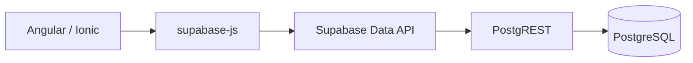
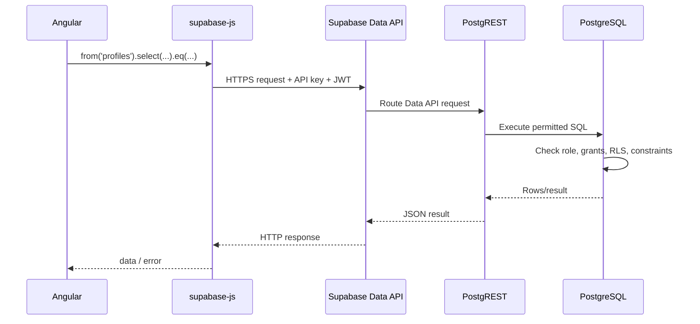
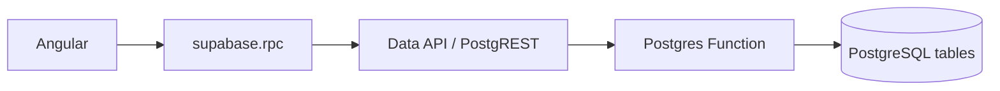
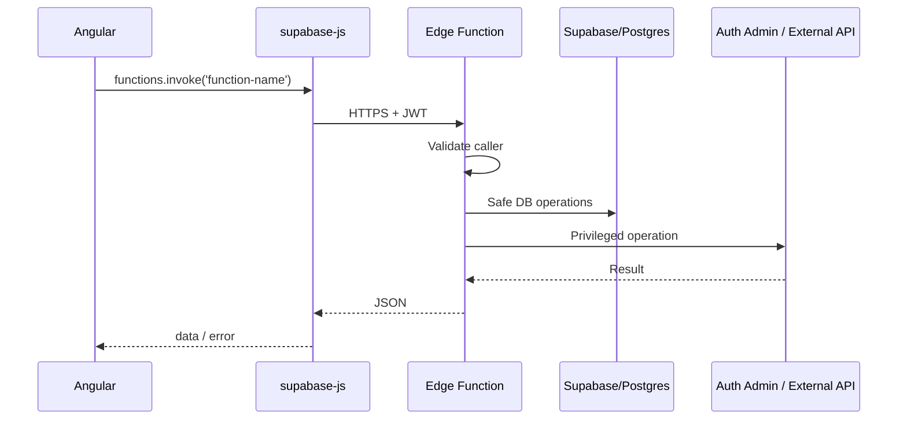
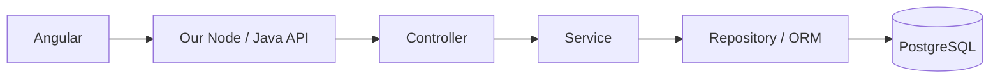
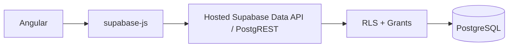
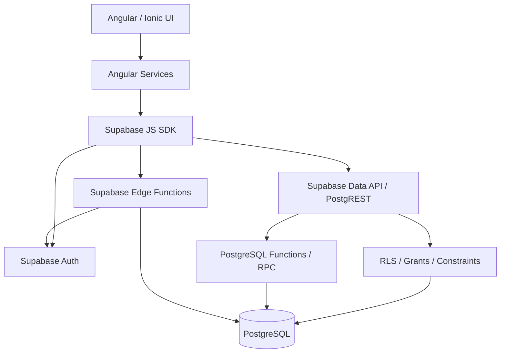
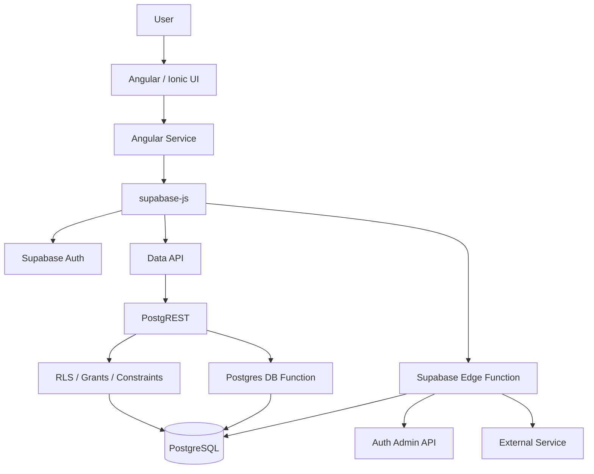

# Supabase Automatic API, Migrations, Functions, and Firebase Comparison

> **Recommended Qurio location:** `docs-2/15-SUPABASE-AUTOMATIC-API-MIGRATIONS-FUNCTIONS.md`
>
> This document explains **where the API comes from in Supabase**, how database tables automatically become API resources, how Qurio creates and changes tables, what a migration is, what kinds of functions exist, and how this architecture compares with Firebase.
>
> The first section explains it like you are a kid. Later sections go progressively deeper.

---

# 1. Explain it like I am a kid

Imagine a school library.

There is a big room containing books.

```text
Library room
=
PostgreSQL database
```

Inside the room there are shelves:

```text
Students shelf
Books shelf
Borrowed-books shelf
```

In a database these are tables:

```text
students
books
borrowed_books
```

Normally, if you want a child outside the library to ask:

> "Show me my borrowed books"

you would need a librarian sitting at a desk.

The child asks the librarian.

The librarian goes inside, finds the books, and comes back.

In a traditional web application:

```text
Angular
   |
   v
Our backend API
   |
   v
Database
```

The backend developer writes the librarian code:

```text
GET /api/books
GET /api/students
POST /api/borrow
```

With Supabase, **Supabase already gives us the librarian**.

When we create a database table named:

```text
books
```

Supabase's Data API can automatically make it available through an API resource such as:

```text
/rest/v1/books
```

We do not write:

```text
books.controller.ts
books.service.ts
GET /api/books
```

for ordinary CRUD.

The Supabase platform already provides the generic API server.

So:

```text
Angular
   |
   v
Supabase's already-hosted API
   |
   v
PostgreSQL
```

The most important sentence in this entire document is:

> **Supabase does not remove the backend. Supabase provides the backend for us.**

Qurio does not maintain a normal Node.js/Java/.NET API server for every database operation.

---

# 2. Where is this automatic API actually hosted?

It is hosted by Supabase.

For a Supabase project, the Data API is available under a project URL similar to:

```text
https://<project-ref>.supabase.co/rest/v1/
```

Suppose Qurio has this table:

```text
public.profiles
```

The Data API can expose it conceptually as:

```text
https://<project-ref>.supabase.co/rest/v1/profiles
```

Qurio normally does not call that URL manually.

Instead it uses the JavaScript SDK:

```ts
supabase.from('profiles').select('*');
```

The SDK builds the HTTP request for us.

So this:

```ts
supabase.from('profiles').select('*');
```

roughly means:

```text
GET /rest/v1/profiles?select=*
```

There is no `profiles-api.ts` file because the generic CRUD API is part of the Supabase platform itself.

---

# 3. The component that creates the automatic API: PostgREST

Supabase's Data REST API is powered by **PostgREST**.

PostgREST sits in front of PostgreSQL.



PostgREST understands PostgreSQL database objects such as:

```text
tables
views
relationships
functions
roles
permissions
```

It reflects the exposed database schema and presents allowed database operations through HTTP.

That is the "automatic API generation" you were looking for.

It is not generating TypeScript controller files inside Qurio.

It is dynamically exposing the database schema through the hosted Data API.

---

# 4. What does "reflecting the schema" mean?

A PostgreSQL database stores metadata about itself.

It knows:

```text
which schemas exist
which tables exist
which columns exist
column data types
primary keys
foreign keys
views
functions
permissions
```

PostgREST reads this metadata.

Conceptually:

```text
PostgreSQL schema
      |
      | inspect metadata
      v
PostgREST
      |
      | automatically exposes API shape
      v
REST API
```

If an exposed table contains:

```text
profiles
--------
id
email
display_name
role
status
created_at
```

the API layer understands that those fields exist.

That is why Angular can write:

```ts
supabase.from('profiles').select('id,email,display_name,status');
```

without us creating a REST controller by hand.

---

# 5. Important: not every database object should automatically be usable by everyone

"Automatic API" does **not** mean:

```text
Every table is public.
Anyone can read everything.
```

API availability and actual access depend on things such as:

```text
exposed schemas
PostgreSQL GRANT / REVOKE
RLS policies
caller authentication
JWT
table/function permissions
```

Qurio intentionally treats the browser as untrusted.

Even if an endpoint exists, PostgreSQL still decides whether the request is allowed.

---

# 6. The complete automatic CRUD flow

Suppose Qurio executes:

```ts
const { data, error } = await supabase.from('profiles').select('*').eq('id', userId);
```

The real flow is:



Angular does not execute SQL.

Angular sends an HTTP request.

The server runs SQL.

---

# 7. Automatic API pattern: table to REST resource

The basic pattern is:

```text
Postgres table
     ↓
Data API resource
```

Example:

```text
public.profiles
```

becomes conceptually:

```text
/rest/v1/profiles
```

Then common CRUD operations look like this.

## Read

Angular:

```ts
supabase.from('profiles').select('*');
```

Conceptually:

```http
GET /rest/v1/profiles?select=*
```

## Insert

Angular:

```ts
supabase.from('bookmarks').insert({
  user_id: userId,
  content_id: contentId,
  resource_type: 'note',
});
```

Conceptually:

```http
POST /rest/v1/bookmarks
```

## Update

Angular:

```ts
supabase
  .from('user_settings')
  .update({
    theme: 'dark',
  })
  .eq('user_id', userId);
```

Conceptually:

```http
PATCH /rest/v1/user_settings?user_id=eq.<uuid>
```

## Delete

Angular:

```ts
supabase.from('bookmarks').delete().eq('content_id', contentId);
```

Conceptually:

```http
DELETE /rest/v1/bookmarks?content_id=eq.<id>
```

This generic CRUD API is already implemented and hosted by Supabase.

---

# 8. Relationships can also be understood from PostgreSQL

Suppose PostgreSQL contains:

```text
authors
books
```

and `books.author_id` is a foreign key to `authors.id`.

Because that relationship exists in the database schema, PostgREST can understand the relationship.

The database schema itself becomes an important part of the API definition.

This is different from manually maintaining:

```text
database schema
+
REST DTO schema
+
API controller schema
+
ORM mapping
```

as four separate layers.

---

# 9. How do we create a table?

There are several ways.

## Method A — Supabase Dashboard / Table Editor

You can create a table visually.

Example:

```text
Table: notes

id          uuid
user_id     uuid
title       text
body        text
created_at  timestamptz
```

This is easy while learning.

However, for a serious project, the structure should eventually be captured in migration SQL so it is reproducible and version controlled.

## Method B — SQL

Example:

```sql
create table public.notes (
  id uuid primary key default gen_random_uuid(),
  user_id uuid not null references auth.users(id) on delete cascade,
  title text not null,
  body text not null,
  created_at timestamptz not null default now()
);
```

Once the table exists in the exposed API schema and permissions are configured, the Data API can reflect it.

There is no separate REST controller generation step.

---

# 10. But creating the table is not enough

For a browser-facing Supabase application, we should also think about:

```text
RLS
policies
GRANT / REVOKE
constraints
foreign keys
indexes
```

For example:

```sql
alter table public.notes enable row level security;
```

Then:

```sql
create policy notes_read_own
on public.notes
for select
to authenticated
using (
  user_id = auth.uid()
);
```

And:

```sql
create policy notes_insert_own
on public.notes
for insert
to authenticated
with check (
  user_id = auth.uid()
);
```

Then appropriate grants:

```sql
grant select, insert on public.notes to authenticated;
```

Now Angular can call the API, but PostgreSQL enforces who can access which rows.

---

# 11. Why RLS is so important

**RLS = Row Level Security**

Suppose User A changes the browser code from:

```ts
supabase.from('notes').select('*').eq('user_id', myId);
```

to:

```ts
supabase.from('notes').select('*');
```

If security existed only in Angular, User A could see everyone.

With RLS:

```text
request arrives
   |
   v
PostgreSQL RLS checks auth.uid()
   |
   v
only User A's rows are allowed
```

So the true security boundary is the database, not the Angular component.

---

# 12. What is a migration? Explain it like a kid

Imagine you built a LEGO house.

Version 1:

```text
1 bedroom
1 door
```

Tomorrow you add:

```text
1 window
```

Next week:

```text
1 garage
```

You could simply change the house and forget what you changed.

But then nobody knows how to recreate the exact house.

A **migration** is like keeping instructions for every change:

```text
Step 1: build bedroom
Step 2: add window
Step 3: add garage
```

For a database:

```text
001 create profiles
002 add admin functions
003 add learner state
004 add auto approval
...
```

A migration is a **versioned database change**.

---

# 13. Formal migration definition

A database migration is a file containing SQL that changes database structure or behavior.

Examples:

```sql
create table ...
alter table ...
create index ...
create policy ...
create function ...
create trigger ...
grant ...
revoke ...
```

Supabase's official workflow stores migration files under:

```text
supabase/migrations/
```

A typical CLI-generated migration is named something like:

```text
20260917220000_create_notes.sql
```

Qurio currently also has historically numbered migrations such as:

```text
001_qurio_auth_foundation.sql
002_qurio_admin_control.sql
...
009_qurio_unverified_status_timestamp.sql
```

Do **not** rename migrations that have already been applied merely to make them prettier.

Once an executed migration becomes history, prefer adding a new migration for the next change.

---

# 14. Why migrations matter

Without migrations:

```text
Developer changes production DB manually
        |
        v
No exact history
        |
        v
Local DB differs from production
        |
        v
Teammate cannot reproduce it
        |
        v
Future debugging becomes painful
```

With migrations:

```text
Git repository
   |
   +-- migration 1
   +-- migration 2
   +-- migration 3
   |
   v
known database history
```

Benefits:

```text
version control
reproducibility
code review
testing
deployment history
rollback planning
team consistency
environment consistency
```

---

# 15. Example migration from start to finish

Suppose Qurio needs a table:

```text
study_notes
```

A migration might be:

```sql
begin;

create table public.study_notes (
  id uuid primary key default gen_random_uuid(),
  user_id uuid not null references auth.users(id) on delete cascade,
  title text not null,
  body text not null,
  created_at timestamptz not null default now(),
  updated_at timestamptz not null default now()
);

alter table public.study_notes enable row level security;

create policy study_notes_read_own
on public.study_notes
for select
to authenticated
using (
  user_id = auth.uid()
);

create policy study_notes_insert_own
on public.study_notes
for insert
to authenticated
with check (
  user_id = auth.uid()
);

grant select, insert on public.study_notes to authenticated;

commit;
```

After this is applied:

```text
PostgreSQL knows the table
        |
        v
PostgREST refreshes/reflection sees API object
        |
        v
Angular can use:
supabase.from('study_notes')
```

No new Node/Java controller is required.

---

# 16. Supabase CLI migration workflow

A standard Supabase CLI workflow can look like:

```bash
supabase migration new create_study_notes
```

This creates a SQL migration file.

Edit it.

Then test locally, commonly with:

```bash
supabase db reset
```

When using a linked Supabase project, migrations can be deployed with the appropriate Supabase CLI database push workflow, such as:

```bash
supabase db push
```

The exact deployment process should follow Qurio's chosen environment workflow.

Important rule:

> Once you adopt migrations as the source of truth, avoid making random production schema changes that are not captured back into migration history.

---

# 17. Migration vs data

A migration usually changes **structure or behavior**.

Examples:

```text
add column
create table
create function
add RLS policy
create index
```

This is different from ordinary app data:

```text
User Anand completed quiz 10.
User X bookmarked chapter 4.
```

That normal runtime data is not a schema migration.

---

# 18. What happens after a migration changes a table?

Suppose migration 1 creates:

```text
profiles:
id
email
```

Later migration 2 adds:

```text
display_name
```

PostgreSQL now knows the new schema.

The Data API reflection sees the new structure.

Then Angular can request:

```ts
supabase.from('profiles').select('id,email,display_name');
```

Again:

```text
database schema changes
        ↓
automatic API reflects schema
```

We do not regenerate an Express controller.

---

# 19. There are three kinds of "functions" in Qurio

This is one of the biggest areas of confusion.

## Type 1 — Angular/TypeScript function

Example:

```ts
async loadProfiles() {
  ...
}
```

Runs:

```text
inside browser / Capacitor WebView
```

It is client code.

---

## Type 2 — PostgreSQL Database Function

Example:

```sql
create or replace function public.owner_demote_admin(...)
returns void
language plpgsql
...
```

Runs:

```text
inside PostgreSQL
```

Angular calls it using:

```ts
supabase.rpc('owner_demote_admin', {
  target_user_id: id,
});
```

This is usually called an RPC from the client side.

---

## Type 3 — Supabase Edge Function

Example repository path:

```text
supabase/functions/admin-delete-user/index.ts
```

Runs:

```text
on Supabase's server-side Edge Runtime
```

Angular calls it using:

```ts
supabase.functions.invoke('admin-delete-user', ...);
```

This is the closest equivalent to a Firebase Cloud Function / traditional serverless API function.

---

# 20. PostgreSQL Database Functions are not Supabase-only

This is important.

A function like:

```sql
create function public.calculate_score(...)
```

is a PostgreSQL feature.

It is not invented by Supabase.

What Supabase adds is a convenient way to expose permitted Postgres functions through its Data API.

Pattern:

```text
Postgres function
      |
      v
PostgREST RPC endpoint
      |
      v
supabase.rpc(...)
```

Conceptually:

```text
POST /rest/v1/rpc/function_name
```

---

# 21. Example Database Function

Imagine Qurio wants a function:

```sql
create or replace function public.get_my_note_count()
returns bigint
language sql
security invoker
as $$
  select count(*)
  from public.study_notes
  where user_id = auth.uid();
$$;
```

Angular could call:

```ts
const { data, error } = await supabase.rpc('get_my_note_count');
```

Flow:



---

# 22. Why use an RPC instead of several Angular queries?

Suppose approval requires:

```text
check caller
check target
check email verification
check target status
update status
store actor
store timestamp
insert audit entry
```

Doing all of this as separate Angular calls is weaker:

```text
request 1
request 2
request 3
request 4
...
```

A database function can perform the whole database transaction in one controlled server-side operation.

That gives:

```text
atomicity
centralized validation
consistent authorization
consistent auditing
less client trust
```

---

# 23. What is PL/pgSQL?

**PL/pgSQL** is PostgreSQL's procedural language.

Plain SQL:

```sql
select ...
update ...
insert ...
```

PL/pgSQL additionally gives us:

```text
variables
IF
ELSE
loops
exceptions
multiple statements
```

Example:

```sql
create or replace function public.example()
returns void
language plpgsql
as $$
begin
  if auth.uid() is null then
    raise exception 'Login required';
  end if;

  update public.some_table
  set updated_at = now();
end
$$;
```

Qurio uses PL/pgSQL for important account workflows.

---

# 24. Supabase-specific PostgreSQL helpers

Some PostgreSQL functions in Qurio become Supabase-specific because they rely on Supabase's Auth integration.

Examples:

```sql
auth.uid()
```

and:

```text
auth.users
```

`auth.uid()` gives the current authenticated user's UUID inside appropriate Supabase/Postgres request context.

So:

```sql
user_id = auth.uid()
```

means:

```text
this row belongs to the currently authenticated Supabase user
```

---

# 25. Supabase Auth trigger functions

Qurio has another important function pattern.

When Supabase Auth creates a row in:

```text
auth.users
```

a PostgreSQL trigger can automatically create:

```text
public.profiles
```

Conceptually:

```mermaid
flowchart TD
    A[User signs up] --> B[Supabase Auth]
    B --> C[auth.users INSERT]
    C --> D[Postgres trigger]
    D --> E[handle_new_auth_user()]
    E --> F[public.profiles INSERT]
```

This is why Angular does not need to perform a second insecure "create profile" request after signup.

The database handles it.

---

# 26. What is a trigger?

A trigger says:

> "When this database event happens, automatically run this database function."

Example:

```sql
create trigger on_auth_user_created
after insert on auth.users
for each row
execute function public.handle_new_auth_user();
```

Meaning:

```text
new Auth user inserted
      |
      v
automatically execute handle_new_auth_user()
```

No Angular call is required.

---

# 27. What is a Supabase Edge Function?

A Supabase Edge Function is server-side TypeScript.

Example:

```text
supabase/functions/admin-delete-user/index.ts
```

It runs on Supabase's Edge Runtime, which is Deno-compatible.

It can safely hold/use server-only secrets through environment variables.

Use Edge Functions when you need:

```text
service-role privileges
Supabase Auth Admin API
third-party secret keys
webhooks
server-side HTTP calls
cross-service orchestration
```

---

# 28. Edge Function request pattern



---

# 29. Why `admin-delete-user` is an Edge Function

Deleting another Supabase Auth user needs privileged Auth Admin functionality.

Putting this in Angular would require shipping a server secret.

That would be unsafe.

So Qurio does:

```text
Angular
   |
   v
admin-delete-user Edge Function
   |
   +-- validates JWT
   +-- validates actor role/status
   +-- writes audit
   +-- uses service-role server secret
   +-- calls Auth Admin delete
```

The privileged secret never enters the browser.

---

# 30. Database Function vs Edge Function

Use this rule.

| Need                           | Database Function / RPC |                              Edge Function |
| ------------------------------ | ----------------------: | -----------------------------------------: |
| Runs close to SQL/data         |                     Yes |      Can call DB but runs outside Postgres |
| Multi-statement DB transaction |               Excellent | Possible, but DB function is often cleaner |
| Use `auth.uid()`               |                     Yes |               Usually validate JWT/use SDK |
| Complex SQL aggregation        |               Excellent |                        Usually unnecessary |
| Supabase Auth Admin API        |                      No |                                        Yes |
| Third-party API secret         |                      No |                                        Yes |
| Stripe/Resend/webhook logic    |                      No |                                        Yes |
| Service-role secret            |       No need in client |                           Safe server-side |
| Called from Angular            |        `supabase.rpc()` |              `supabase.functions.invoke()` |

---

# 31. Direct Data API vs RPC vs Edge Function

Use this decision tree.

```mermaid
flowchart TD
    A[New operation] --> B{Needs secret, Auth Admin, webhook, or external privileged API?}
    B -- Yes --> C[Use Edge Function]
    B -- No --> D{Multi-step or atomic DB business operation?}
    D -- Yes --> E[Use PostgreSQL Function / RPC]
    D -- No --> F{Can grants + RLS safely authorize normal CRUD?}
    F -- Yes --> G[Use supabase.from(...) Data API]
    F -- No --> H[Reconsider model / RPC / Edge Function]
```

---

# 32. What is special about `supabase.from()`?

When Angular writes:

```ts
supabase.from('profiles');
```

the string:

```text
profiles
```

is not the name of a TypeScript API handler.

It refers to a Postgres relation exposed through Supabase's Data API.

Common relations include:

```text
table
view
materialized view
```

The API is generated from the database model.

---

# 33. What is special about `supabase.rpc()`?

When Angular writes:

```ts
supabase.rpc('admin_approve_user', ...)
```

the name:

```text
admin_approve_user
```

refers to a PostgreSQL Database Function.

It does not refer to:

```text
src/api/admin_approve_user.ts
```

The function lives in PostgreSQL and is normally created by migration SQL.

---

# 34. What is special about `supabase.functions.invoke()`?

When Angular writes:

```ts
supabase.functions.invoke('admin-delete-user', ...)
```

the name:

```text
admin-delete-user
```

refers to a deployed Supabase Edge Function.

This one **does** have code in the repository, for example:

```text
supabase/functions/admin-delete-user/index.ts
```

and it must be deployed.

That is much closer to the Firebase Cloud Function mental model.

---

# 35. Why you could not find a "function host" for normal Supabase CRUD

Because there are two different mechanisms:

```text
Normal table CRUD
→ generic hosted Data API
→ supplied by Supabase/PostgREST
→ no per-table function file

Privileged/custom server workflow
→ Edge Function
→ your own TypeScript file
→ deploy it
```

So your observation was correct.

There is no:

```text
getProfiles Edge Function
saveBookmark Edge Function
getProgress Edge Function
```

because those would duplicate the Data API unless Qurio needed custom server logic.

---

# 36. Traditional API server comparison

Traditional architecture:



Typical code we would maintain:

```text
GET /api/profiles
POST /api/bookmarks
PATCH /api/settings
DELETE /api/bookmarks/:id
```

Supabase Data API architecture:



Supabase removes a lot of repetitive CRUD plumbing.

---

# 37. Firebase comparison: first important correction

For normal **Cloud Firestore** CRUD, Firebase also does not require you to write a Cloud Function.

A web/mobile client can use the Firebase SDK directly:

```text
Angular
   |
   v
Firebase SDK
   |
   v
Cloud Firestore
```

Firestore Security Rules control client access.

Cloud Functions are used when trusted server-side logic is needed.

So conceptually:

```text
Firebase client SDK
≈
Supabase client SDK + Data API

Firestore Security Rules
≈
PostgreSQL grants + RLS

Firebase Cloud Functions
≈
Supabase Edge Functions
```

This comparison is not exact, but it is a useful mental model.

---

# 38. Main difference: Firestore is document-oriented; Supabase is PostgreSQL relational

When we say "Firebase database" here, we mainly mean **Cloud Firestore**.

Firestore organizes data around:

```text
collections
documents
subcollections
```

Example:

```text
users/{userId}/attempts/{attemptId}
```

Supabase's primary database is PostgreSQL:

```text
tables
rows
columns
primary keys
foreign keys
joins
constraints
views
SQL functions
transactions
```

Example:

```text
profiles
quiz_attempts
quiz_attempt_answers
```

with foreign-key relationships.

---

# 39. Firebase vs Supabase data model

## Firestore style

```text
users
  └── user-123
       ├── name
       ├── email
       └── attempts
            └── attempt-456
```

## Supabase/Postgres style

```text
profiles
--------
id
name
email

quiz_attempts
-------------
id
user_id  ---> profiles/auth user
quiz_id
score
```

Supabase is closer to a traditional SQL application.

---

# 40. Security comparison

## Firebase

Client request:

```text
Firebase SDK
      |
      v
Firestore
      |
      v
Firestore Security Rules
```

Rules answer:

```text
Can this request read/write this document?
```

## Supabase

Client request:

```text
supabase-js
      |
      v
Data API
      |
      v
PostgreSQL
      |
      +-- roles
      +-- grants
      +-- RLS
      +-- constraints
```

RLS answers:

```text
Which rows may this caller access?
```

---

# 41. Firebase Rules and RLS are similar in purpose, different in technology

Both solve an important problem:

> The browser/mobile app cannot be trusted to enforce authorization.

Firebase uses a Firebase-specific Security Rules language.

Supabase uses PostgreSQL-native security concepts, especially RLS.

That means Supabase permissions live much closer to the relational database itself.

---

# 42. Firebase functions vs Supabase functions

There are two Supabase concepts, which makes comparison slightly more interesting.

```text
Firebase Cloud Function
        |
        | closest equivalent
        v
Supabase Edge Function
```

But Supabase also has:

```text
PostgreSQL Database Functions
```

So Supabase gives Qurio an extra place to put business logic very close to the data.

Example:

```text
Owner promotes Admin
```

can be a Postgres function because it is primarily database logic.

Example:

```text
Delete Supabase Auth account
```

should be an Edge Function because it needs Auth Admin/server privilege.

---

# 43. Firebase schema changes vs Supabase migrations

Firestore is largely schema-flexible.

Documents in one collection can technically have different fields.

Therefore traditional SQL schema migrations are not the central model in the same way.

Firestore projects still have deployable configuration and may need:

```text
Security Rules changes
index changes
data backfill scripts
application migration logic
```

but there is no PostgreSQL table schema that must be migrated in the same relational sense.

Supabase/Postgres has an explicit schema:

```text
column types
NOT NULL
foreign keys
constraints
indexes
functions
policies
```

So SQL migrations are a core practice.

---

# 44. Firebase vs Supabase summary table

| Topic                               | Supabase                                   | Firebase / Firestore                                       |
| ----------------------------------- | ------------------------------------------ | ---------------------------------------------------------- |
| Main database model                 | PostgreSQL relational                      | Document/collection NoSQL                                  |
| Normal client CRUD                  | `supabase-js` → Data API                   | Firebase SDK → Firestore                                   |
| Need custom backend for basic CRUD? | No                                         | No                                                         |
| Generic API generation              | PostgREST reflects exposed Postgres schema | Firebase SDK/service APIs expose Firestore operations      |
| Client authorization                | Postgres roles/grants/RLS                  | Firestore Security Rules                                   |
| SQL                                 | Yes                                        | Firestore is not SQL-based                                 |
| Joins                               | Native SQL joins/relations                 | Usually model data differently; no normal relational joins |
| Foreign keys                        | Yes                                        | No relational FK constraints                               |
| DB constraints                      | Rich Postgres constraints                  | Mostly application/rules validation                        |
| DB functions                        | PostgreSQL SQL/PLpgSQL functions           | No direct equivalent inside Firestore                      |
| Client-callable DB RPC              | Yes, via `supabase.rpc()`                  | Typically use SDK or Cloud Functions                       |
| Serverless functions                | Supabase Edge Functions                    | Cloud Functions for Firebase                               |
| Function runtime                    | Deno-compatible TypeScript                 | Google Cloud Functions runtimes                            |
| Schema migrations                   | Core relational practice                   | Not the same model for Firestore                           |
| Realtime                            | Optional Supabase Realtime                 | Strongly integrated Firestore real-time listeners          |
| Auth                                | Supabase Auth                              | Firebase Authentication                                    |
| File/object storage                 | Supabase Storage                           | Cloud Storage for Firebase                                 |

---

# 45. Which one is "more backendless"?

Neither is literally backendless.

Both are managed backend platforms.

Better terminology:

```text
BaaS
=
Backend as a Service
```

Firebase manages:

```text
Firestore
Authentication
Storage
Functions
other Google/Firebase services
```

Supabase manages:

```text
PostgreSQL
Data API
Auth
Storage
Realtime
Edge Functions
```

The application developer writes less generic backend plumbing.

---

# 46. Why Supabase feels different from Firebase

Supabase often feels more familiar to developers from traditional backend/SQL systems because the center is:

```text
real PostgreSQL
```

You can think in:

```text
tables
relations
foreign keys
indexes
transactions
SQL
functions
RLS
```

Firebase/Firestore encourages:

```text
documents
collections
denormalization
Security Rules
SDK-driven document queries
```

Neither model is universally better.

They solve similar product problems using different database foundations.

---

# 47. Qurio's actual architecture

Qurio currently fits this shape:



---

# 48. Example: Qurio Admin listing users

Angular service:

```ts
this.supabase.from('profiles').select('*').order('created_at', { ascending: false });
```

No Edge Function is needed merely to read the profiles.

Why?

Because:

```text
Data API already exists
+
Postgres security decides whether caller may read profiles
```

---

# 49. Example: Qurio Owner demotes Admin

Angular:

```ts
this.supabase.rpc('owner_demote_admin', {
  target_user_id: id,
});
```

PostgreSQL function handles:

```text
caller must be approved Owner
target must be Admin
change role to User
record audit entry
```

This is not direct CRUD because it is a business workflow.

---

# 50. Example: Qurio deletes a Supabase Auth user

Angular:

```ts
this.supabase.functions.invoke('admin-delete-user', ...);
```

Why Edge Function?

Because:

```text
Auth Admin delete
requires privileged server-side capability
```

The Edge Function can use a secret that Angular must never know.

---

# 51. When a new Qurio feature needs a migration

A migration is probably needed if the feature requires:

```text
new table
new column
new enum value
new constraint
new index
new RLS policy
new database function
changed database function
new trigger
changed grants
new view
```

Example:

> Add `last_login_at` column.

Migration required.

Example:

> Add a new button that calls an already existing RPC.

Migration probably not required.

Example:

> Add a new Edge Function using existing database structure.

Migration may not be required.

---

# 52. When a new Qurio feature needs an Edge Function

Likely when it needs:

```text
service-role
Auth Admin
secret API key
third-party service
server-side webhook
trusted server-only orchestration
```

Examples:

```text
admin-delete-user
delete-my-account
admin-delete-expired-unverified
```

---

# 53. When a new Qurio feature needs only client code

Only when all needed backend capabilities already exist.

Example:

```text
Display approved-user count
```

If the current caller already has permission to query profiles safely, Angular may only need:

```ts
supabase.from('profiles').select('*', { count: 'exact', head: true }).eq('status', 'approved');
```

No schema change and no privileged operation means no new backend code may be needed.

---

# 54. What happens when we add a new table to Qurio

Recommended mental checklist:

```text
1. Define table
2. Define primary key
3. Define foreign keys
4. Define constraints
5. Add indexes if needed
6. Enable RLS
7. Define policies
8. Set grants
9. Put all of that in migration history
10. Apply/test migration
11. Use table through supabase.from(...)
```

Notice what is missing:

```text
12. Write Express GET controller
13. Write Express POST controller
```

because the Data API already provides generic CRUD.

---

# 55. Example full feature: "My Highlights"

Suppose Qurio needs personal study highlights.

Migration:

```sql
create table public.highlights (
  id uuid primary key default gen_random_uuid(),
  user_id uuid not null references auth.users(id) on delete cascade,
  content_id text not null,
  quote text not null,
  created_at timestamptz not null default now()
);

alter table public.highlights enable row level security;

create policy highlights_own
on public.highlights
for all
to authenticated
using (user_id = auth.uid())
with check (user_id = auth.uid());

grant select, insert, delete
on public.highlights
to authenticated;
```

Then Angular:

```ts
await supabase.from('highlights').insert({
  user_id: currentUserId,
  content_id,
  quote,
});
```

and:

```ts
const { data } = await supabase.from('highlights').select('*').order('created_at', { ascending: false });
```

No custom API route is necessary.

RLS remains the real protection.

---

# 56. A common misunderstanding: "If the API is automatic, isn't it insecure?"

Not if the database is configured correctly.

The API being reachable is expected.

Security comes from authorization.

Imagine a bank building.

```text
Front door exists
```

does not mean:

```text
everyone can enter every vault
```

The Data API is the front door.

RLS/grants are the access-control system.

---

# 57. Another misunderstanding: "Can somebody copy my publishable key?"

Yes.

Treat the browser publishable key as public.

A web application's shipped JavaScript can be inspected.

That is why the public key cannot be the security boundary.

Security relies on:

```text
JWT
RLS
grants
constraints
RPC authorization
Edge Function authorization
```

Never put a service-role/secret key in Angular.

---

# 58. Another misunderstanding: "Why not put every DB call in an Edge Function?"

You could, but then you would rebuild the repetitive backend API layer that Supabase's Data API already provides.

For ordinary safe CRUD:

```text
Angular
→ Data API
→ RLS
→ PostgreSQL
```

is simpler.

Use Edge Functions only where server-side code adds real value or privilege.

---

# 59. Another misunderstanding: "Does PostgREST execute random SQL received from the browser?"

No.

The browser uses a structured REST/query interface.

The client does not normally send:

```sql
drop table users;
```

as arbitrary SQL through `supabase.from()`.

PostgREST maps supported HTTP/API operations to SQL based on the exposed schema and permissions.

This is fundamentally different from exposing a raw PostgreSQL connection to the browser.

---

# 60. Another misunderstanding: "Is RPC unsafe because clients can call it?"

A client-callable RPC must be designed as a public API surface.

If an RPC is callable by `authenticated`, assume a malicious authenticated user can call it manually.

Therefore the function itself must enforce:

```text
auth.uid()
caller role
caller status
target rules
input validation
business invariants
```

Never rely only on:

```text
the button is visible only to Owner
```

---

# 61. `SECURITY INVOKER` vs `SECURITY DEFINER`

PostgreSQL functions can run with different privilege models.

## SECURITY INVOKER

Runs with caller privileges.

Safer default for many operations.

## SECURITY DEFINER

Runs with the function owner's privileges.

Useful for carefully controlled privileged database workflows.

But then the function must be defensive:

```text
validate auth.uid()
validate caller
validate target
limit EXECUTE grants
schema-qualify objects
use safe search_path
```

Qurio already uses `SECURITY DEFINER` for controlled account-management functions.

---

# 62. Why functions are normally added by migration

Suppose you create:

```sql
public.owner_demote_admin(...)
```

only manually in the Supabase SQL Editor.

Production now has it.

But the repository may not.

Later:

```text
new environment
new developer
database rebuild
disaster recovery
```

cannot reliably recreate the function.

So the function definition belongs in migration SQL.

The migration becomes the source-controlled history of database behavior.

---

# 63. SQL Editor vs migration file

SQL Editor:

```text
great for exploration
manual diagnosis
one-off investigation
testing SQL
```

Migration:

```text
reproducible
reviewable
version-controlled
deployable
historical
```

For production schema changes, prefer migration history.

If you test SQL manually first, copy the final intended schema/function change into a migration before treating the work as complete.

---

# 64. Data migration vs schema migration

Sometimes a migration also repairs existing data.

Example:

```sql
update public.profiles
set status = 'unverified'
where ...
```

That is a **data migration/backfill**.

A file can contain both:

```text
schema change
+
data repair
```

Be careful because data migrations run against real existing production rows.

---

# 65. Migration numbering in Qurio

Your current documentation/database history uses files like:

```text
001_qurio_auth_foundation.sql
002_qurio_admin_control.sql
003_qurio_learner_state.sql
...
009_qurio_unverified_status_timestamp.sql
```

Treat already-applied migration files as immutable history.

If you discover a bug after `009`, create:

```text
010_...
```

rather than editing `008` and pretending production had always used the new content.

If you later standardize on Supabase CLI-generated timestamps, do so deliberately; do not casually rename already-executed migration history.

---

# 66. Automatic API after a function migration

Suppose a migration creates:

```sql
create function public.get_learning_summary(...)
returns table (...)
...
```

PostgREST can expose this function as an RPC endpoint.

Angular can then use:

```ts
supabase.rpc('get_learning_summary', ...);
```

Pattern:

```text
Migration creates DB function
        ↓
Postgres now owns function
        ↓
Data API/PostgREST exposes permitted RPC
        ↓
Angular calls with supabase.rpc()
```

No Edge Function deployment is required for a pure PostgreSQL function.

---

# 67. Edge Function deployment is different

Creating a file:

```text
supabase/functions/delete-my-account/index.ts
```

does not automatically make it live just because Git contains it.

It must be deployed to Supabase.

Pattern:

```text
write Edge Function code
        ↓
test
        ↓
deploy function
        ↓
Supabase hosts HTTPS function endpoint
        ↓
Angular invokes it
```

This is different from a database migration.

---

# 68. Database deployment vs Edge Function deployment

Think of two independent deployment channels.

```text
Database migration
    ↓
changes PostgreSQL

Edge Function deployment
    ↓
changes server-side TypeScript runtime
```

Angular deployment is yet another channel:

```text
Angular build
    ↓
GitHub Pages / Android bundle
```

Qurio therefore has multiple deployable layers:

```text
Client
Database
Edge Functions
```

---

# 69. One complete Qurio request map



---

# 70. Simple memory trick

Remember these four lines:

```text
.from()
= table/view CRUD

.rpc()
= PostgreSQL function

.functions.invoke()
= Supabase Edge Function

.auth.*
= Supabase Auth service
```

That explains most Qurio-to-Supabase communication.

---

# 71. Supabase vs Firebase memory trick

```text
Supabase
= Postgres-first BaaS

Firebase / Firestore
= document-database-first BaaS
```

And:

```text
Supabase RLS
~ Firebase Security Rules

Supabase Edge Functions
~ Firebase Cloud Functions

Supabase Postgres RPC
= an extra SQL/database-function layer that has no direct Firestore equivalent
```

---

# 72. Which architecture fits Qurio well?

Qurio contains strongly related data:

```text
users
roles
statuses
quiz attempts
answers
bookmarks
progress
exam plans
audit history
```

Relationships and consistency matter.

PostgreSQL features are therefore useful:

```text
foreign keys
constraints
transactions
joins
indexes
database functions
RLS
```

That makes Supabase a natural architecture for this style of application.

This does not mean Firebase could not implement Qurio.

It means the modeling style would be different.

---

# 73. Practical checklist when Codex adds a Supabase feature

Ask Codex to answer:

```text
Does this need a new table/column/function/policy?
→ migration

Is this ordinary user-owned CRUD?
→ Data API + RLS

Is this a multi-step database business rule?
→ Postgres Function / RPC

Does this need service-role/Auth Admin/external secret?
→ Edge Function

Does the client only need to display/use existing capability?
→ Angular code may be enough
```

Then separately test:

```text
Can a malicious caller bypass the Angular UI?
```

The answer must still be:

```text
No unauthorized server/database action succeeds.
```

---

# 74. Abbreviations used in this architecture

| Abbreviation | Meaning                            |
| ------------ | ---------------------------------- |
| API          | Application Programming Interface  |
| BaaS         | Backend as a Service               |
| CRUD         | Create, Read, Update, Delete       |
| DB           | Database                           |
| SQL          | Structured Query Language          |
| RLS          | Row Level Security                 |
| RPC          | Remote Procedure Call              |
| REST         | Representational State Transfer    |
| SDK          | Software Development Kit           |
| JWT          | JSON Web Token                     |
| Auth         | Authentication                     |
| UUID         | Universally Unique Identifier      |
| PK           | Primary Key                        |
| FK           | Foreign Key                        |
| DDL          | Data Definition Language           |
| DML          | Data Manipulation Language         |
| DCL          | Data Control Language              |
| DQL          | Data Query Language                |
| TCL          | Transaction Control Language       |
| PL/pgSQL     | PostgreSQL Procedural Language     |
| CORS         | Cross-Origin Resource Sharing      |
| RBAC         | Role-Based Access Control          |
| ABAC         | Attribute-Based Access Control     |
| OTP          | One-Time Password / one-time token |
| SMTP         | Simple Mail Transfer Protocol      |

---

# 75. Final answer to the original question

You were asking:

> "In Firebase I understand there is a managed backend. In Supabase I do not see the function that becomes the API. Where is it?"

The answer is:

```text
For ordinary tables, the API is not one custom function per table.

Supabase hosts a generic Data API powered by PostgREST.

PostgREST reflects the exposed PostgreSQL schema.

Table:
public.profiles

becomes an API resource:
REST /profiles

Angular:
supabase.from('profiles')

calls that hosted API.

PostgreSQL then executes the actual operation
under grants, RLS, and constraints.
```

When the generic API is not enough:

```text
Postgres Database Function
→ supabase.rpc()

or

Supabase Edge Function
→ supabase.functions.invoke()
```

That is the complete Supabase backend model used by Qurio.

---

# 76. Read this together with the existing Qurio docs

Recommended order:

```text
00-START-HERE.md
01-SYSTEM-ARCHITECTURE.md
05-DATABASE-DESIGN.md
10-SECURITY-RLS.md
11-EDGE-FUNCTIONS.md
14-SUPABASE-CLIENT-DATABASE-FLOW.md
15-SUPABASE-AUTOMATIC-API-MIGRATIONS-FUNCTIONS.md
```

`14` explains the client-to-database flow.

`15` explains **where the automatic API comes from, how migrations build the database, what each function type means, and how Supabase compares with Firebase**.

---

# 77. Official references

Supabase:

- Data REST API: https://supabase.com/docs/guides/api
- Database overview: https://supabase.com/docs/guides/database/overview
- Database migrations: https://supabase.com/docs/guides/deployment/database-migrations
- Database Functions: https://supabase.com/docs/guides/database/functions
- Edge Functions: https://supabase.com/docs/guides/functions

Firebase / Firestore:

- Firebase Security Rules: https://firebase.google.com/docs/rules
- Firestore security: https://firebase.google.com/docs/firestore/security/overview
- Firestore Security Rules conditions: https://firebase.google.com/docs/firestore/security/rules-conditions
