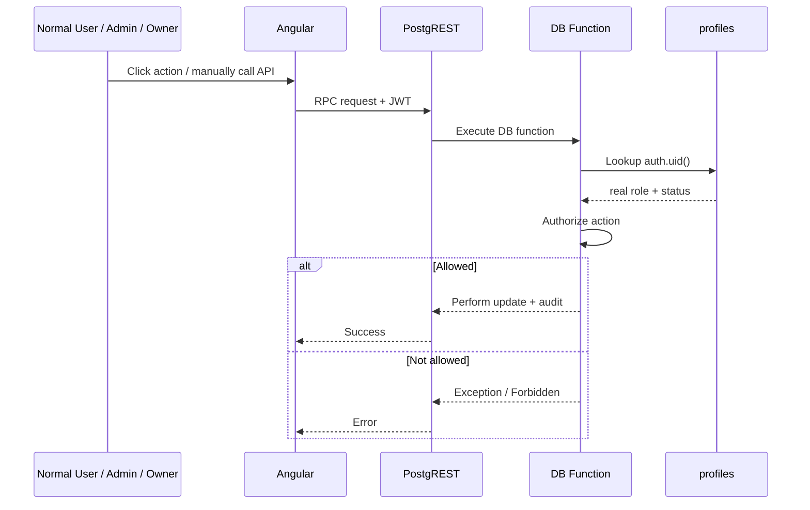

# Qurio Role Security at Database Level

> **Recommended repository location:** `docs-2/16-ROLE-AUTHORIZATION-DB-LEVEL.md`
>
> This document explains how Qurio protects **Owner**, **Admin**, and normal **User** permissions at the database/server level, even if someone modifies the Angular app or manually calls the Supabase API.

---

# 1. Main rule

Qurio must never trust the Angular UI for authorization.

This is only UX:

```text
Show Admin button
Hide Owner button
Disable Delete button
```

A user can modify browser code, call Supabase manually, or bypass Angular routes.

The real rule must be enforced here:

```text
JWT
  ↓
auth.uid()
  ↓
public.profiles
  ↓
role + status
  ↓
RLS / Database Function / Edge Function
```

---

# 2. Qurio application roles

Qurio stores the application role in:

```text
public.profiles.role
```

Possible values:

```text
owner
admin
user
```

The account status is stored separately:

```text
public.profiles.status
```

Examples:

```text
unverified
pending
approved
denied
suspended
```

A role alone is not enough.

For staff access, Qurio normally requires:

```text
status = approved

AND

role = owner OR admin
```

---

# 3. Authentication first, authorization second

Supabase Auth answers:

```text
Who is this caller?
```

The JWT identifies the signed-in user.

PostgreSQL can then obtain that user's ID using:

```sql
auth.uid()
```

Qurio then checks:

```sql
public.profiles.id = auth.uid()
```

and reads the real application role/status.

So the trusted chain is:

```mermaid
flowchart TD
    A[Angular / Browser] --> B[Supabase JWT]
    B --> C[Supabase Auth validates token]
    C --> D[auth.uid()]
    D --> E[public.profiles]
    E --> F{status = approved?}
    F -- No --> G[Reject privileged action]
    F -- Yes --> H{role}
    H -- user --> I[Normal user permissions]
    H -- admin --> J[Admin permissions]
    H -- owner --> K[Owner permissions]
```

---

# 4. Why spoofing Angular does not give Admin access

Suppose a normal user changes Angular code from:

```ts
auth.isAdmin() === false;
```

to:

```ts
auth.isAdmin() === true;
```

They may make the Admin button appear locally.

But this only changes their browser.

It does **not** change:

```text
public.profiles.role
```

on Supabase.

When the user calls a protected RPC or Edge Function, the server checks the JWT and loads the real profile.

Conceptually:

```text
Browser says:
"I am Admin"

Server says:
"JWT identifies user 123"

Database says:
"user 123 has role = user"

Result:
Forbidden
```

---

# 5. Database-level Admin check

A protected PostgreSQL function can use a pattern like:

```sql
select *
from public.profiles
where id = auth.uid()
  and status = 'approved'
  and role in ('owner', 'admin');
```

If no row matches:

```text
Staff access required
```

This check runs inside PostgreSQL.

Angular cannot bypass it.

---

# 6. Owner-only check

For Owner-only operations:

```sql
select *
from public.profiles
where id = auth.uid()
  and status = 'approved'
  and role = 'owner';
```

Examples of Owner-only operations:

```text
Promote User -> Admin
Demote Admin -> User
Manage Owner-only controls
Read full audit history
```

Even if an Admin manually calls an Owner RPC, PostgreSQL rejects it.

---

# 7. Admin permissions

An approved Admin can have permissions such as:

```text
Approve eligible users
Deny users
Suspend users
Reactivate users
Resend verification
Delete normal user accounts
Clean old unverified accounts
```

But Admin should not be allowed to:

```text
Promote another Admin
Demote another Admin
Delete Owner
Change Owner role
Bypass max-admin limit
```

These rules must be enforced server-side.

---

# 8. Owner permissions

Owner has higher application privileges.

Typical Owner permissions:

```text
Everything Admin can do
Promote approved User -> Admin
Demote Admin -> User
View full audit log
Manage Owner-only policy settings
```

Protected rules should still exist:

```text
Owner cannot accidentally demote Owner through Admin flow
Owner self-delete is blocked unless ownership transfer exists
Only one Owner is allowed
Admin limit remains enforced
```

---

# 9. Normal User permissions

A normal approved User should normally access only their own learning/account data.

Examples:

```text
Own profile
Own settings
Own progress
Own quiz attempts
Own bookmarks
Own exam-plan progress
```

RLS can enforce:

```sql
user_id = auth.uid()
```

So even if a user sends:

```ts
supabase.from('study_progress').select('*');
```

PostgreSQL still returns only rows allowed by RLS.

---

# 10. RLS example

Example policy concept:

```sql
create policy study_progress_own
on public.study_progress
for select
to authenticated
using (
  user_id = auth.uid()
);
```

This means:

```text
User A
→ can read User A rows

User A
→ cannot read User B rows
```

Angular does not decide this.

PostgreSQL does.

---

# 11. Staff profile reads

Qurio can use a helper such as:

```text
current_user_is_staff()
```

Conceptually:

```sql
exists (
  select 1
  from public.profiles
  where id = auth.uid()
    and status = 'approved'
    and role in ('owner', 'admin')
)
```

Then profile RLS can support:

```text
Normal user
→ read own profile

Approved Admin/Owner
→ read all profiles needed by Control Center
```

---

# 12. RPC protection

For database business operations, Qurio uses RPC.

Example:

```ts
supabase.rpc('admin_approve_user', {
  target_user_id: id,
});
```

The client can call the RPC.

But the PostgreSQL function must independently check:

```text
caller
caller status
caller role
target
target role
target status
email verification
business rules
```

Flow:



---

# 13. Edge Function protection

Some actions need server-only privileges.

Examples:

```text
Delete Supabase Auth user
Resend verification for another user
Use service-role key
Call external secret API
```

These use Edge Functions.

The Edge Function must:

```text
1. Read Authorization Bearer JWT
2. Ask Supabase Auth who the caller is
3. Load caller profile
4. Check role/status
5. Validate target
6. Perform privileged action
```

The request body is never trusted as proof of role.

---

# 14. Edge Function example

Conceptually:

```ts
const { user } = await validateJwt(request);

const actor = await loadProfile(user.id);

if (actor.status !== 'approved' || !['owner', 'admin'].includes(actor.role)) {
  throw new Error('Forbidden');
}
```

The important part is:

```text
actor role comes from database

NOT from:
request.role
localStorage
Angular signal
form field
```

---

# 15. What if someone changes the request body?

A malicious user may send:

```json
{
  "role": "owner",
  "targetUserId": "someone-else"
}
```

The server should ignore any client-supplied role.

Correct server logic:

```text
JWT
→ caller user ID
→ database profile
→ real role/status
```

So:

```text
request.role = owner
```

has no authority.

---

# 16. What if someone changes the JWT?

JWTs are cryptographically signed.

If someone edits the token contents manually, the signature becomes invalid.

Supabase Auth rejects the modified token.

A valid normal-user JWT still identifies the same normal user.

Qurio then reads that user's role from:

```text
public.profiles
```

So changing Angular cannot upgrade:

```text
user -> admin
```

---

# 17. Security responsibility map

```mermaid
flowchart LR
    A[Angular UI] --> B[JWT]
    B --> C[Supabase Auth]
    C --> D[auth.uid()]
    D --> E[public.profiles]

    E --> F[RLS]
    E --> G[Database RPC checks]
    E --> H[Edge Function checks]

    F --> I[Normal data access]
    G --> J[Controlled DB business actions]
    H --> K[Privileged server actions]
```

---

# 18. UI checks vs real security

UI:

```ts
@if (auth.isOwner()) {
  // show Demote Admin
}
```

Purpose:

```text
good UX
hide irrelevant actions
avoid accidental clicks
```

But not security.

Real protection:

```sql
where id = auth.uid()
and status = 'approved'
and role = 'owner'
```

inside PostgreSQL or equivalent server-side check.

---

# 19. Qurio permission model summary

| Action                             | User | Admin | Owner |
| ---------------------------------- | ---: | ----: | ----: |
| Use approved learning features     |  Yes |   Yes |   Yes |
| Read own profile                   |  Yes |   Yes |   Yes |
| Read Admin Control Center profiles |   No |   Yes |   Yes |
| Approve users                      |   No |   Yes |   Yes |
| Deny/Suspend users                 |   No |   Yes |   Yes |
| Resend verification                |   No |   Yes |   Yes |
| Delete normal user                 |   No |   Yes |   Yes |
| Promote User -> Admin              |   No |    No |   Yes |
| Demote Admin -> User               |   No |    No |   Yes |
| Read full account audit            |   No |    No |   Yes |
| Delete Owner directly              |   No |    No |    No |

---

# 20. Main rule to remember

Assume:

```text
Angular can be changed
Buttons can be forced visible
Requests can be manually created
Route guards can be bypassed
Client data can be forged
```

Therefore:

> **Every privileged Qurio action must be authorized again inside PostgreSQL or a Supabase Edge Function using the authenticated JWT and the real `public.profiles` role/status.**

That is what prevents a normal user from spoofing Admin or Owner access.
