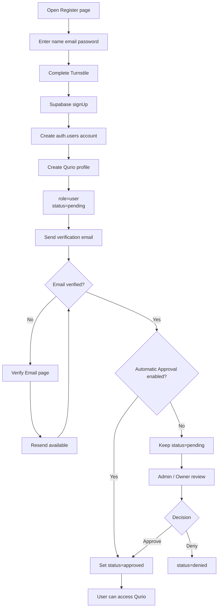
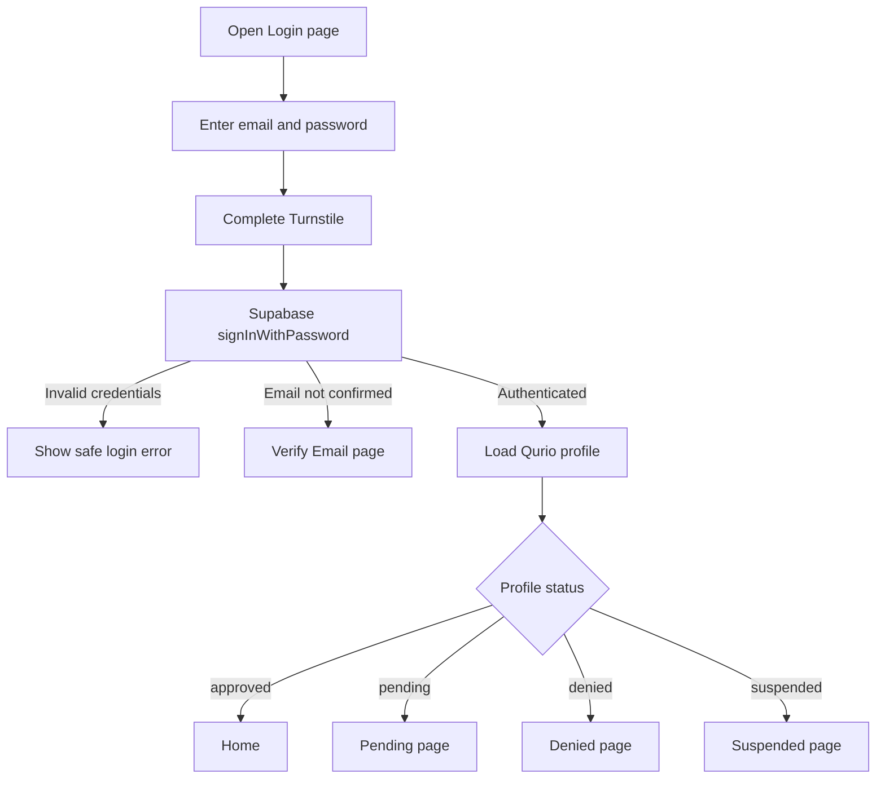
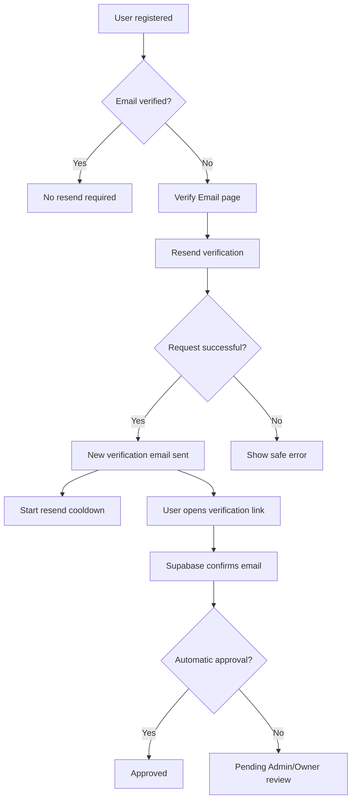

# Qurio Registration, Verification, Approval and Login Flow

## Purpose

This document explains the complete Qurio account lifecycle:

- registration / sign-up;
- Cloudflare Turnstile protection;
- email verification;
- resend verification;
- Owner-controlled automatic approval;
- manual Admin/Owner approval;
- login;
- pending / denied / suspended account handling;
- password recovery;
- the relationship between Supabase Auth and Qurio `profiles`.

For domain-based authentication protection and environment/domain configuration, also see:

```text
docs/DOMAIN-BASED-LOGIN.md
```

---

## High-Level Security Model

Qurio uses the following layers:

```text
Qurio Web / Android
        |
        v
Cloudflare Turnstile
        |
        v
Supabase Auth
        |
        v
Email verification
        |
        v
Qurio profile status
        |
        +--> pending
        +--> approved
        +--> denied
        +--> suspended
        |
        v
RLS + grants + protected RPCs
```

The Supabase publishable key is public by design.

A successful Supabase login alone does **not** mean that a user may use Qurio. Application access additionally depends on the user's Qurio profile being:

```text
status = approved
```

---

# 1. Account States

Qurio uses the following profile statuses:

| Status      | Meaning                                       | Can use Qurio learning features? |
| ----------- | --------------------------------------------- | -------------------------------- |
| `pending`   | Account exists but approval has not completed | No                               |
| `approved`  | Account is allowed to use Qurio               | Yes                              |
| `denied`    | Registration/access was rejected              | No                               |
| `suspended` | Previously allowed account has been suspended | No                               |

Roles are separate from account status:

| Role    | Purpose                                                  |
| ------- | -------------------------------------------------------- |
| `owner` | Single application owner with full administration rights |
| `admin` | Administrator who can manage user access                 |
| `user`  | Normal Qurio learner                                     |

A normal registration always starts as:

```text
role   = user
status = pending
```

The database automatically creates the corresponding `profiles` row when a Supabase Auth user is created.

---

# 2. Registration / Sign-Up Flow

The user opens:

```text
/auth/register
```

The form collects:

```text
Name
Email
Password
Confirm password
```

Production registration also requires a valid Cloudflare Turnstile challenge.

Conceptually:

```text
Registration form
       |
       v
Validate form
       |
       v
Complete Turnstile
       |
       v
captchaToken
       |
       v
Supabase signUp()
       |
       v
auth.users row created
       |
       v
Qurio database trigger
       |
       v
profiles row created
role=user
status=pending
       |
       v
Verification email sent
       |
       v
/auth/verify-email
```

The profile is created as `pending` even before approval.

The signup is also written to the Qurio account audit log.

---

# 3. Turnstile During Registration

Registration should not be submitted until both conditions are true:

```text
Form valid
AND
Turnstile token available
```

The Turnstile token is passed to Supabase Auth during `signUp()`.

The token must be treated as:

```text
short-lived
single-use
in-memory only
```

Do not store a CAPTCHA token in:

```text
localStorage
IndexedDB
Supabase
long-lived app settings
```

After a registration attempt, the challenge should be reset.

If the challenge expires, the user must complete a new one.

---

# 4. Verification Email

After successful registration, Qurio navigates the user to:

```text
/auth/verify-email
```

The verification page explains that the user must confirm their email before account approval can complete.

The verification link normally redirects through the production Qurio callback:

```text
${environment.appUrl}/auth/callback
```

Current production value:

```text
https://actionanand.github.io/qurio/auth/callback
```

When Supabase confirms the email:

```text
auth.users.email_confirmed_at
```

is populated.

Qurio's database trigger then updates:

```text
profiles.email_verified_at
```

and adds an:

```text
email_verified
```

entry to the account audit log.

Email verification is therefore separate from Qurio access approval.

---

# 5. Resend Verification Flow

If the user did not receive the confirmation message, the verification page provides:

```text
Resend verification email
```

Current Qurio behavior includes a cooldown after a successful resend so the user cannot repeatedly trigger the action immediately.

Conceptually:

```text
/auth/verify-email
       |
       v
Resend verification
       |
       v
Supabase Auth resend()
       |
       v
New verification email
       |
       v
60-second UI cooldown
```

The email address used by the verification page is retained temporarily in session storage for the verification workflow.

The installed Supabase Auth API supports `captchaToken` for resend. Qurio requires a fresh Turnstile token, passes it through the supported option, resets it after the request, and retains the existing 60-second success cooldown and Supabase rate limiting.

---

# 6. Admin-Initiated Verification Resend

Admin/Owner users can also see unverified pending accounts in:

```text
Admin Control Center
```

For a profile with:

```text
status = pending
email_verified_at = null
```

Admin/Owner can request:

```text
Resend verification
```

This allows staff to help a user who registered successfully but did not receive or complete the original confirmation email.

Admin approval is intentionally disabled until:

```text
email_verified_at IS NOT NULL
```

Therefore an administrator cannot approve an unverified account.

Admin/Owner password-reset email requests are also CAPTCHA protected. After staff confirm the selected account, Qurio opens a compact Turnstile dialog, consumes one fresh token for `resetPasswordForEmail`, then clears and resets the challenge after success or failure.

---

# 7. What Happens After Email Verification?

This depends on the Owner-controlled setting:

```text
auto_approve_verified_users
```

There are two possible paths.

---

## Path A — Automatic Approval ON

When:

```text
auto_approve_verified_users = true
```

and a normal user verifies their email:

```text
role   = user
status = pending
email_verified_at != null
```

Qurio automatically changes:

```text
status = approved
```

The account audit log records:

```text
auto_approve
```

with the reason:

```text
Automatically approved after email verification
```

The user does **not** need to wait for manual Admin approval.

Flow:

```text
Register
   |
   v
Verify email
   |
   v
Auto approval enabled?
   |
   +-- YES
   |
   v
status = approved
   |
   v
User may sign in and use Qurio
```

### Important existing pending users

If the Owner changes Automatic Approval from OFF to ON, Qurio also checks existing accounts that are:

```text
role = user
status = pending
email_verified_at IS NOT NULL
```

Those already-verified pending users are automatically approved at that time.

So enabling the setting affects:

1. future users when they verify their email; and
2. existing verified users who are still waiting in `pending`.

---

## Path B — Automatic Approval OFF

When:

```text
auto_approve_verified_users = false
```

email verification does **not** automatically approve the user.

After verification the account remains:

```text
role   = user
status = pending
```

The user must wait for an Admin or Owner.

Flow:

```text
Register
   |
   v
Verify email
   |
   v
Auto approval enabled?
   |
   +-- NO
   |
   v
status remains pending
   |
   v
Admin / Owner reviews account
   |
   +--> Approve
   |      |
   |      v
   |   approved
   |
   +--> Deny
          |
          v
       denied
```

The application must not allow a pending user to access protected Qurio learning routes.

---

# 8. Owner Automatic Approval Control

Only the Qurio Owner can change automatic approval.

The setting is available in:

```text
Admin Control Center
→ Automatic Approval
```

Conceptually:

```text
Owner
   |
   v
Automatic Approval toggle
   |
   +--> ON
   |     Verified pending users are approved automatically
   |
   +--> OFF
         Verified new users wait for Admin/Owner review
```

Changes are written to the account audit log.

Admins can approve users manually, but they cannot change the global automatic-approval policy.

---

# 9. Manual Admin / Owner Approval

An Admin or Owner may approve a normal user only when the email has already been verified.

The database enforces this rule.

Required state:

```text
role = user
email_verified_at IS NOT NULL
```

The approval operation changes:

```text
status:
pending/denied/suspended
    ->
approved
```

depending on the action being performed.

For initial registration approval:

```text
pending -> approved
```

The audit log records:

```text
actor
target user
previous status
new status
timestamp
```

The user can then access protected application features.

---

# 10. Denial

Admin/Owner can deny a normal user.

A denial requires a reason.

Example:

```text
status = denied
status_reason = "..."
```

A denied account cannot use protected Qurio learning features.

The denial is recorded in the audit log.

A denied user can later be reactivated by Admin/Owner, provided the email is verified.

---

# 11. Suspension

An approved normal user may later be suspended.

A suspension requires a reason.

Flow:

```text
approved
   |
   v
Admin / Owner suspends
   |
   v
suspended
```

The user may still possess a Supabase session, but Qurio's application guards and database authorization must prevent protected application use.

A suspended account can later be reactivated.

---

# 12. Reactivation

Admin/Owner can reactivate a:

```text
denied
```

or:

```text
suspended
```

normal user.

Email verification is required before reactivation.

Successful reactivation changes:

```text
status = approved
```

and writes an audit entry.

---

# 13. Login Flow

The user opens:

```text
/auth/login
```

The form requests:

```text
Email
Password
Turnstile
```

Production flow:

```text
Login form
    |
    v
Validate email/password
    |
    v
Complete Turnstile
    |
    v
captchaToken
    |
    v
Supabase signInWithPassword()
    |
    +--> invalid credentials
    |       |
    |       v
    |   show safe error
    |
    +--> email not confirmed
    |       |
    |       v
    |   /auth/verify-email
    |
    +--> authenticated
            |
            v
      Load Qurio profile
            |
            v
      inspect profile.status
```

After Supabase authentication succeeds, Qurio does **not** automatically send every user to `/home`.

The live Qurio profile determines the destination.

---

# 14. Login Routing by Account Status

Qurio routes authenticated users according to the profile:

```text
No Supabase session
        |
        v
/auth/login
```

```text
Authenticated
status = pending
        |
        v
/auth/pending
```

```text
Authenticated
status = approved
        |
        v
/home
```

```text
Authenticated
status = denied
        |
        v
/auth/denied
```

```text
Authenticated
status = suspended
        |
        v
/auth/suspended
```

Therefore:

```text
Supabase authentication != Qurio authorization
```

A user must be both:

```text
authenticated
AND
approved
```

to access normal Qurio learning routes.

---

# 15. Login Before Email Verification

If a registered user tries to sign in before email verification, Supabase may return:

```text
email_not_confirmed
```

Qurio then redirects the user to:

```text
/auth/verify-email
```

and retains the email temporarily so the verification page can offer resend functionality.

Flow:

```text
Login
  |
  v
Credentials correct
  |
  v
Email confirmed?
  |
  +-- NO --> /auth/verify-email
  |
  +-- YES --> continue to profile status check
```

---

# 16. Login After Verification With Auto Approval ON

Example:

```text
User registers
       |
       v
status=pending
       |
       v
User verifies email
       |
       v
Automatic Approval = ON
       |
       v
status=approved
       |
       v
User signs in
       |
       v
/home
```

There is no manual waiting step.

---

# 17. Login After Verification With Auto Approval OFF

Example:

```text
User registers
       |
       v
status=pending
       |
       v
User verifies email
       |
       v
Automatic Approval = OFF
       |
       v
status remains pending
       |
       v
User signs in
       |
       v
/auth/pending
       |
       v
Admin/Owner approves
       |
       v
status=approved
       |
       v
User can enter /home
```

The user does not need to create another account.

They wait on the existing account until approval occurs.

---

# 18. Registration Decision Flow



---

# 19. Login Decision Flow



---

# 20. Resend Verification Decision Flow



---

# 21. Auto Approval vs Manual Approval Summary

| Email verified?                                        | Auto approval | Result                                                 |
| ------------------------------------------------------ | ------------- | ------------------------------------------------------ |
| No                                                     | OFF           | `pending`, cannot be manually approved yet             |
| No                                                     | ON            | `pending`; automatic approval waits until verification |
| Yes                                                    | OFF           | `pending`, waits for Admin/Owner                       |
| Yes                                                    | ON            | automatically becomes `approved`                       |
| Yes + already pending when Owner enables auto approval | switched ON   | automatically becomes `approved`                       |

Important:

```text
Automatic Approval never bypasses email verification.
```

A user's email must be verified before automatic approval takes effect.

---

# 22. Admin Capabilities

An approved Admin can manage normal user accounts.

Typical capabilities include:

```text
View pending users
View unverified users
Approve verified users
Deny users
Suspend approved users
Reactivate denied/suspended users
Resend verification for unverified pending users
Send password-reset email
```

The Owner additionally controls:

```text
Automatic Approval
Admin promotion
Admin demotion
Audit log
```

Qurio supports at most:

```text
3 Admin accounts
```

The Owner is separate from that Admin count.

---

# 23. Audit History

Important account events are recorded in:

```text
account_audit_log
```

Examples include:

```text
signup
email_verified
approve
auto_approve
deny
suspend
reactivate
promote_admin
demote_admin
auto_approval_enabled
auto_approval_disabled
```

This allows the Owner to review who changed an account and when.

---

# 24. Password Reset Flow

Password-reset requests should also use Turnstile in production.

Flow:

```text
Forgot Password
      |
      v
Enter email
      |
      v
Complete Turnstile
      |
      v
Supabase resetPasswordForEmail()
      |
      v
Reset email
      |
      v
${environment.appUrl}/auth/update-password?recovery=1
      |
      v
Establish recovery session
      |
      v
Choose new password
      |
      v
Update password
      |
      v
Sign out
      |
      v
/auth/login
```

The current production base URL is:

```text
https://actionanand.github.io/qurio
```

but callback URLs must be derived from:

```ts
environment.appUrl;
```

rather than duplicated throughout the codebase.

---

# 25. Domain-Based CAPTCHA Protection

The production Turnstile widget is restricted to:

```text
actionanand.github.io
```

because the current production application is:

```text
https://actionanand.github.io/qurio
```

The `/qurio` part is a path.

The Turnstile hostname comes from:

```ts
new URL(environment.appUrl).hostname;
```

The hosted Android challenge page comes from:

```ts
`${environment.appUrl}/auth/challenge`;
```

See `DOMAIN-BASED-LOGIN.md` for the complete domain/security configuration.

---

# 26. Local Development

Supabase may keep a localhost redirect for development, for example:

```text
http://localhost:3039/**
```

This redirect allowlist does not replace Turnstile protection.

Production Turnstile should remain restricted to the production hostname.

With the checked-in development configuration, Turnstile is disabled and protected Auth actions fail closed. No sign-in, signup, recovery-email, or verification-resend request is sent without a token. Existing authenticated sessions and non-Auth application features can still initialize normally.

For intentional local CAPTCHA testing, first enable the development setting, then use:

```text
Cloudflare test keys
```

or:

```text
a separate development widget
```

rather than permanently adding localhost to the production widget.

---

# 27. Important Security Rules

Do not confuse these concepts:

```text
Email verification
!=
Qurio approval
```

```text
Supabase authentication
!=
Qurio authorization
```

```text
Supabase publishable key
!=
secret
```

The final access decision should conceptually be:

```text
Valid Turnstile
    +
Valid Supabase credentials
    +
Verified email
    +
Qurio status = approved
    +
RLS / RPC authorization
```

Never expose client-side:

```text
Supabase service_role
Supabase sb_secret
database password
Turnstile secret
Resend API key
SMTP password
```

---

# 28. Expected User Experience

## New user, auto approval ON

```text
Register
→ Verify email
→ Automatically approved
→ Sign in
→ Home
```

## New user, auto approval OFF

```text
Register
→ Verify email
→ Pending approval
→ Admin/Owner approves
→ Sign in / refresh
→ Home
```

## User has not verified email

```text
Register
→ Verification email
→ Verification not completed
→ Login attempt
→ Verify Email page
→ Resend if needed
```

## User denied

```text
Sign in
→ Auth succeeds
→ Qurio profile = denied
→ Denied page
```

## User suspended

```text
Sign in
→ Auth succeeds
→ Qurio profile = suspended
→ Suspended page
```

---

# 29. Current Production Values

```text
Production application:
https://actionanand.github.io/qurio

Registration:
https://actionanand.github.io/qurio/auth/register

Login:
https://actionanand.github.io/qurio/auth/login

Verification callback:
https://actionanand.github.io/qurio/auth/callback

Password recovery:
https://actionanand.github.io/qurio/auth/update-password

Hosted Android Turnstile challenge:
https://actionanand.github.io/qurio/auth/challenge

Turnstile hostname:
actionanand.github.io
```

These should be derived from `environment.appUrl` wherever practical.

---

# 30. Implementation References

Relevant Qurio areas include:

```text
src/app/auth/register.page.ts
src/app/auth/login.page.ts
src/app/auth/verify-email.page.ts
src/app/auth/forgot-password.page.ts
src/app/auth/update-password.page.ts

src/app/services/auth.service.ts
src/app/services/auth.guards.ts
src/app/services/admin.service.ts

src/app/admin/admin-users.page.ts

supabase/migrations/001_qurio_auth_foundation.sql
supabase/migrations/002_qurio_admin_control.sql
supabase/migrations/004_qurio_auto_approval.sql
```

---

## Final Rule

A newly registered Qurio user must always pass through:

```text
Registration
→ Email Verification
→ Approval decision
→ Approved access
```

The only difference is **who performs the approval**:

```text
Automatic Approval ON
→ Qurio approves the verified normal user automatically

Automatic Approval OFF
→ Admin or Owner must approve the verified normal user manually
```

No configuration should allow an unverified normal user to become approved.
