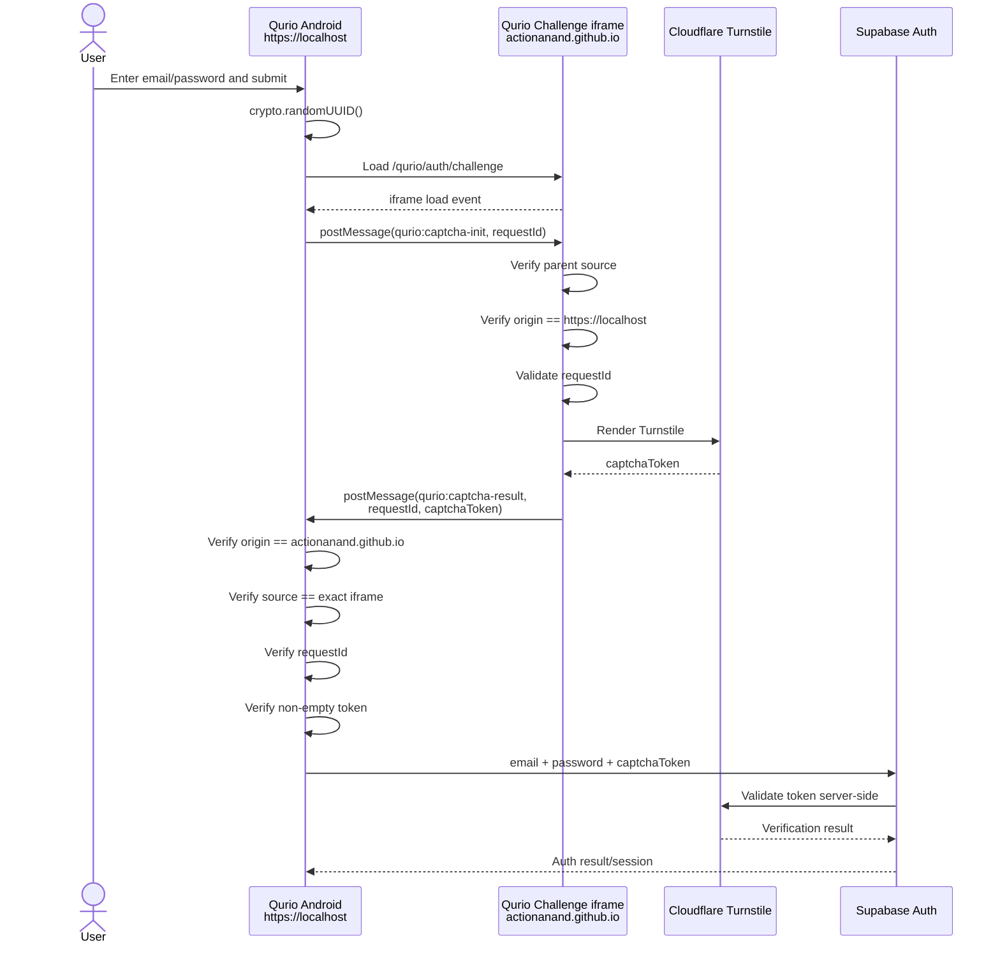
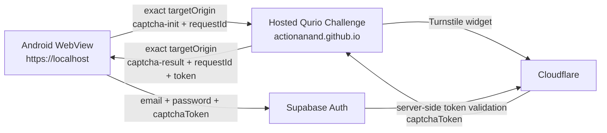

# Qurio Android ↔ Website Turnstile Verification — Current Implementation

> **Repository reviewed:** `actionanand/qurio`  
> **Purpose:** Explain in detail how the Qurio Android app, whose Capacitor WebView origin is `https://localhost`, can securely use the deployed Qurio website at `https://actionanand.github.io/qurio` to complete Cloudflare Turnstile verification.

---

## 1. The key idea

The Qurio Android app and the Qurio website are two different web origins:

```text
Android Capacitor WebView:
https://localhost

Hosted Qurio website:
https://actionanand.github.io
```

The Android app does **not** change its whole page from `https://localhost` to the website.

Instead, the Android app creates an **iframe** inside its existing WebView and loads only the CAPTCHA challenge page from the real Qurio website:

```text
https://actionanand.github.io/qurio/auth/challenge
```

Conceptually:

```text
Android WebView
https://localhost
┌───────────────────────────────────────────────────────────┐
│ Qurio Android UI                                          │
│                                                           │
│  Email:    user@example.com                               │
│  Password: ********                                       │
│                                                           │
│  ┌─────────────────────────────────────────────────────┐  │
│  │ iframe                                              │  │
│  │                                                     │  │
│  │ https://actionanand.github.io/qurio/auth/challenge │  │
│  │                                                     │  │
│  │          Cloudflare Turnstile runs here             │  │
│  └─────────────────────────────────────────────────────┘  │
└───────────────────────────────────────────────────────────┘
```

This is possible because browsers and Android WebViews are allowed to display a page from another origin inside an iframe, subject to the remote site's framing/security rules.

The two pages remain isolated by the browser's **Same-Origin Policy**. They cannot freely read each other's JavaScript variables or DOM.

To communicate intentionally across that origin boundary, Qurio uses the standard browser API:

```text
window.postMessage(...)
```

That is the core technology behind this design.

---

# 2. The three important origins

For the current Qurio implementation, keep these three concepts separate.

| Purpose                         | Origin / URL                          |
| ------------------------------- | ------------------------------------- |
| Android Capacitor app           | `https://localhost`                   |
| Qurio production website origin | `https://actionanand.github.io`       |
| Qurio application base URL      | `https://actionanand.github.io/qurio` |

The production environment currently defines:

```ts
production: true

appUrl:
https://actionanand.github.io/qurio

androidApp.webViewOrigin:
https://localhost
```

These two values have different jobs.

`appUrl` tells Qurio where its official hosted application lives.

`webViewOrigin` tells the hosted challenge which parent origin is allowed to initialize it when running from Android.

---

# 3. Current implementation files

The current flow is mainly implemented in:

```text
src/app/auth/auth-captcha.component.ts
src/app/auth/challenge.page.ts
src/app/auth/captcha.service.ts
src/app/auth/hosted-auth.util.ts
src/app/services/auth.service.ts
src/app/app.routes.ts
src/environments/environment.prod.ts
src/environments/environment.ts
```

The dedicated Angular route is:

```text
auth/challenge
```

Therefore, with the production `appUrl`, its complete hosted URL becomes:

```text
https://actionanand.github.io/qurio/auth/challenge
```

---

# 4. What happens when the Android login page needs CAPTCHA

Suppose the user opens Qurio Android and enters:

```text
email
password
```

The login page also contains the reusable:

```text
AuthCaptchaComponent
```

Inside `AuthCaptchaComponent`, Qurio detects whether it is running on a native Capacitor platform.

Conceptually:

```ts
Capacitor.isNativePlatform();
```

For Android:

```text
native = true
```

The component therefore chooses:

```text
useHostedFrame = true
```

Instead of rendering Turnstile directly under:

```text
https://localhost
```

it starts the hosted-frame flow.

This is important.

Cloudflare does not need to trust Android's `https://localhost` origin as the production CAPTCHA hostname because Turnstile itself will actually execute inside the Qurio website iframe.

---

# 5. Android generates a random request ID

The Android-side CAPTCHA component begins a new verification request.

The current code generates:

```ts
crypto.randomUUID();
```

For example:

```text
54f91ac7-648a-4ae5-b260-74a04a85f659
```

This becomes the temporary identity of one CAPTCHA transaction.

Conceptually:

```text
Android
   |
   | create requestId
   v
requestId = 54f91ac7-...
```

Why is this useful?

Without a request ID, an old or unrelated iframe response could theoretically arrive later and be mistaken for the current CAPTCHA result.

With the request ID, Qurio can require:

```text
returned requestId === active requestId
```

before accepting the token.

---

# 6. Android constructs the hosted challenge URL

`CaptchaService` derives the challenge URL from:

```ts
environment.appUrl;
```

through the helper:

```ts
hostedChallengeUrl();
```

The current logic builds:

```text
environment.appUrl
        +
/auth/challenge
```

which in production becomes:

```text
https://actionanand.github.io/qurio/auth/challenge
```

The Android component also adds the request ID as a query parameter to the iframe URL.

Conceptually:

```text
https://actionanand.github.io/qurio/auth/challenge?request=<random-id>
```

In the current implementation, the trusted request initialization is still performed through the explicit `postMessage` handshake described below. The query parameter is not relied upon as the security decision.

---

# 7. Android creates the iframe

The current `AuthCaptchaComponent` renders an iframe similar to:

```html
<iframe src="https://actionanand.github.io/qurio/auth/challenge" sandbox="allow-scripts allow-same-origin allow-forms">
</iframe>
```

The parent page is still:

```text
https://localhost
```

but the iframe itself has loaded:

```text
https://actionanand.github.io
```

So there are now two different origins inside the same Android WebView:

```text
Parent
https://localhost

Child iframe
https://actionanand.github.io
```

This is perfectly normal web technology.

A browser can display many origins simultaneously.

For example, the same concept is used by:

- payment widgets
- embedded videos
- identity/login widgets
- CAPTCHA providers
- maps
- customer-support widgets

What the browser prevents is unrestricted JavaScript access between different origins.

---

# 8. Same-Origin Policy protects the boundary

Because:

```text
https://localhost
```

and:

```text
https://actionanand.github.io
```

have different origins, the parent cannot simply do something like:

```ts
iframe.contentWindow.document.body;
```

and inspect the remote page.

Likewise, the website iframe cannot freely inspect the Android application's DOM.

This isolation is enforced by the WebView/browser.

That security mechanism is called the:

```text
Same-Origin Policy
```

So Qurio needs an explicit communication channel.

That channel is:

```text
postMessage
```

---

# 9. Why `postMessage` works across origins

`window.postMessage()` is specifically designed for controlled communication between windows/frames that may come from different origins.

It allows one window to send structured data to another:

```text
Parent window
        |
        | postMessage(...)
        v
Child iframe
```

or:

```text
Child iframe
        |
        | postMessage(...)
        v
Parent window
```

The critical security rule is:

> Never trust a message merely because it arrived.

Both sides need to validate where it came from.

Qurio does this.

---

# 10. The initialization handshake

Loading the iframe is not enough.

The hosted challenge page initially waits for Android to prove that it is the expected parent.

When the iframe's `load` event fires, Android obtains the iframe's `contentWindow`.

It then sends an initialization message.

Conceptually:

```ts
iframe.contentWindow.postMessage(
  {
    type: 'qurio:captcha-init',
    requestId,
  },
  'https://actionanand.github.io',
);
```

Notice the second argument:

```text
https://actionanand.github.io
```

It is an **exact target origin**.

Qurio does not send the initialization using:

```text
*
```

This means the browser should deliver the message only to the intended hosted origin.

---

# 11. What the website challenge checks

The challenge route is implemented by:

```text
ChallengePage
```

Before it accepts the initialization message, it performs several checks.

First, it verifies that the challenge itself is running at the official hosted Qurio location.

Conceptually:

```text
window.location.origin
must equal
https://actionanand.github.io
```

and the path must be within the configured Qurio base path:

```text
/qurio
```

This prevents the challenge component from being treated as valid when loaded somewhere unexpected.

---

# 12. The hosted page checks the Android parent origin

The challenge page listens for:

```text
message
```

events.

For an initialization request to be accepted, the current implementation checks:

```text
event.source === window.parent
```

and:

```text
event.origin === environment.androidApp.webViewOrigin
```

The production value is:

```text
environment.androidApp.webViewOrigin =
https://localhost
```

So the hosted page is effectively saying:

```text
"I will initialize this Android CAPTCHA transaction only
if the message came from my actual parent window and that
parent identifies as https://localhost."
```

It then validates the message structure and request ID.

The initialization message must be:

```text
type = qurio:captcha-init
requestId = valid random-looking ID
```

Once accepted, the challenge stores:

```text
requestId
targetOrigin
```

and stops listening for further initialization attempts.

---

# 13. Why this is a handshake

The sequence is therefore:

```text
Android parent
https://localhost
      |
      | load iframe
      v
Hosted challenge
https://actionanand.github.io
      |
      | waits
      |
Android parent
      |
      | qurio:captcha-init + requestId
      v
Hosted challenge
      |
      | verify parent source
      | verify https://localhost
      | verify requestId
      v
Challenge initialized
```

This is more controlled than simply letting the hosted page immediately generate a token and broadcast it.

---

# 14. Turnstile renders inside the website iframe

After initialization, the challenge page displays:

```text
AuthCaptchaComponent
```

but with:

```text
hostedMode = true
```

This matters.

In ordinary Android mode, `AuthCaptchaComponent` creates the hosted iframe.

Inside the hosted challenge page, `hostedMode=true` prevents it from creating another iframe.

Instead, it renders Cloudflare Turnstile directly into the hosted page.

So the structure is:

```text
Android WebView
https://localhost
┌──────────────────────────────────────────────┐
│                                             │
│ iframe                                      │
│ https://actionanand.github.io               │
│ ┌─────────────────────────────────────────┐ │
│ │                                         │ │
│ │ Cloudflare Turnstile widget             │ │
│ │ rendered DIRECTLY here                  │ │
│ │                                         │ │
│ └─────────────────────────────────────────┘ │
│                                             │
└──────────────────────────────────────────────┘
```

There is no endless iframe recursion.

---

# 15. What hostname Cloudflare sees

This is the most important part of the design.

Although the outer Android application is:

```text
https://localhost
```

the Turnstile JavaScript executes in the child document whose location is:

```text
https://actionanand.github.io/qurio/auth/challenge
```

Therefore the relevant website hostname for the Turnstile widget is:

```text
actionanand.github.io
```

That is why the final production Cloudflare hostname configuration only needs:

```text
actionanand.github.io
```

Android does not require Cloudflare's production widget to permanently whitelist:

```text
localhost
```

The Android origin is used only as the trusted **parent side of Qurio's own iframe handshake**.

Turnstile itself runs on the real website.

---

# 16. Cloudflare completes the challenge

The hosted `AuthCaptchaComponent` loads the official Turnstile script and renders the widget using the configured public site key.

When Cloudflare is satisfied, its JavaScript callback receives a CAPTCHA token.

Conceptually:

```ts
callback: token => {
  // token returned by Turnstile
};
```

At this point the token exists inside:

```text
https://actionanand.github.io
```

not yet in the Android parent.

---

# 17. The website sends the token back to Android

The hosted `ChallengePage` receives the Turnstile token.

It creates a result message containing:

```text
type
requestId
captchaToken
```

Conceptually:

```json
{
  "type": "qurio:captcha-result",
  "requestId": "54f91ac7-...",
  "captchaToken": "..."
}
```

It then calls:

```ts
window.parent.postMessage(...)
```

The important part is the target origin.

The challenge previously recorded the verified parent origin during initialization:

```text
https://localhost
```

So the result is sent specifically back to:

```text
https://localhost
```

not to:

```text
*
```

---

# 18. Android does not immediately trust the returned token

The Android parent has its own `message` listener.

When a result arrives, the current Qurio code validates all of these:

```text
event.origin
event.source
requestId
captchaToken
```

Specifically:

### Origin

The result must come from:

```text
https://actionanand.github.io
```

### Source

The source window must be exactly:

```text
the iframe's contentWindow
```

This is stronger than checking the origin alone.

Another frame from the same origin should not be accepted accidentally.

### Request ID

The response must contain the currently active random request ID.

### Token

The CAPTCHA token must exist and must not be empty.

Only when all checks pass does Qurio accept the token.

---

# 19. Complete message round trip

The exact conceptual round trip is:

```text
Qurio Android
https://localhost
        |
        | 1. Generate random requestId
        |
        | 2. Create iframe
        v
https://actionanand.github.io/qurio/auth/challenge
        |
        | 3. iframe loaded
        ^
        |
Android parent
        |
        | 4. postMessage:
        |    qurio:captcha-init
        |    requestId
        v
Hosted challenge
        |
        | 5. Verify:
        |    source == parent
        |    origin == https://localhost
        |    valid requestId
        |
        | 6. Render Turnstile
        v
Cloudflare Turnstile
        |
        | 7. captchaToken
        v
Hosted challenge
        |
        | 8. postMessage:
        |    qurio:captcha-result
        |    requestId
        |    captchaToken
        v
Qurio Android
        |
        | 9. Verify:
        |    origin == https://actionanand.github.io
        |    source == challenge iframe
        |    requestId matches
        |    token is not empty
        v
CAPTCHA accepted
```

---

# 20. Why both sides validate opposite origins

This is an elegant part of the design.

The **website challenge** trusts only the Android origin:

```text
https://localhost
```

The **Android parent** trusts only the website origin:

```text
https://actionanand.github.io
```

So communication is intentionally two-way:

```text
Android trusts Website
Website trusts Android parent origin
```

Conceptually:

```text
        trust check                         trust check
            --->                               <---
https://localhost  <------ postMessage ------>  https://actionanand.github.io
```

---

# 21. The two-minute timeout

When Android starts a hosted challenge, Qurio also starts:

```text
120,000 ms
```

which is:

```text
2 minutes
```

If no trusted CAPTCHA result arrives in that time:

```text
challenge fails
token is cleared
message listener is removed
timer is removed
UI enters error state
```

This prevents a challenge from remaining active indefinitely.

---

# 22. Cleanup after success

When a valid token arrives, the Android component calls its cleanup logic.

It removes:

```text
message listener
timeout
temporary native challenge state
```

This matters because otherwise a later message might accidentally be handled by an old listener.

Cleanup also runs when:

```text
component is destroyed
challenge is reset
challenge times out
```

---

# 23. What happens after Android has the token

At this point Android has:

```text
email
password
captchaToken
```

The credentials were never sent to the hosted challenge page.

Now `AuthService` performs the actual authentication.

For sign-in the current implementation calls Supabase roughly as:

```ts
supabase.auth.signInWithPassword({
  email,
  password,
  options: {
    captchaToken,
  },
});
```

So the path is now:

```text
Android
    |
    | email
    | password
    | captchaToken
    v
Supabase Auth
```

The Qurio website is no longer involved in that Auth request.

---

# 24. The website never sees the password

This distinction is important.

The challenge website receives:

```text
requestId
Turnstile interaction
captchaToken
```

It does **not** receive:

```text
email
password
Supabase access token
Supabase refresh token
PIN
biometric secret
user session
```

Therefore the hosted page is not an authentication proxy.

It is only a **CAPTCHA token broker between the Android WebView and Cloudflare**, with tightly controlled cross-origin messaging.

---

# 25. Supabase performs the server-side CAPTCHA check

The Android app then sends the CAPTCHA token to Supabase.

Supabase has already been configured with the private Cloudflare Turnstile secret.

Conceptually:

```text
Android
   |
   | captchaToken
   v
Supabase Auth
   |
   | private Turnstile secret
   | server-side validation
   v
Cloudflare verification
```

The private Turnstile secret is not present in the Android bundle or Qurio website frontend.

Only the public site key is in frontend code.

---

# 26. Why someone cannot simply omit CAPTCHA

The current `AuthService` has its own fail-closed check.

Before protected Auth methods call Supabase, it requires a non-empty CAPTCHA token.

Conceptually:

```ts
requireCaptchaToken(captchaToken);
```

If the token is missing:

```text
CAPTCHA_REQUIRED
```

and Qurio refuses to send the protected request.

This is client-side defense in depth.

More importantly, Supabase CAPTCHA protection independently performs server-side validation.

Therefore editing Qurio's JavaScript to bypass its local check does not produce a valid Cloudflare token.

---

# 27. Sign-up, sign-in, resend, and password reset

The current `AuthService` applies CAPTCHA tokens to multiple protected operations.

### Sign up

```text
signUp(...)
+
captchaToken
```

### Sign in

```text
signInWithPassword(...)
+
captchaToken
```

### Resend verification

```text
auth.resend(...)
+
captchaToken
```

### Request password reset

```text
resetPasswordForEmail(...)
+
captchaToken
```

The later `updatePassword()` operation is performed after the user has entered a valid recovery flow/session and is not the same initial CAPTCHA-protected request.

---

# 28. What happens after Supabase accepts the login

CAPTCHA only answers:

```text
"Was a valid Turnstile challenge supplied?"
```

It does not replace Qurio's account rules.

After authentication, Qurio still evaluates the existing profile state.

Examples:

```text
approved
pending
denied
suspended
```

The current routing behavior remains:

```text
approved  -> /home
pending   -> /auth/pending
denied    -> /auth/denied
suspended -> /auth/suspended
```

Email verification and profile-role logic also remain separate from CAPTCHA.

---

# 29. Why `https://localhost` is not the same as a normal website called localhost

This can be confusing.

In a Capacitor Android application:

```text
https://localhost
```

is a virtual/local origin used by the WebView to host the packaged Angular application.

It does not mean the phone is running the public Qurio website on a conventional Internet server at localhost.

Think of it as:

```text
Android APK assets
       |
       v
Capacitor WebView
       |
       v
presented to web code as
https://localhost
```

This gives the web application a normal-looking secure origin inside the WebView.

The application can still make Internet requests and load remote frames such as:

```text
https://actionanand.github.io
https://*.supabase.co
https://challenges.cloudflare.com
```

subject to browser/WebView/network/security policies.

---

# 30. A useful mental model

Think of the Android app as a secure room.

```text
ANDROID ROOM
https://localhost
```

Inside that room is a window looking at a remote office:

```text
IFRAME WINDOW
https://actionanand.github.io
```

The Android room cannot walk into the remote office and inspect everything there because of the Same-Origin Policy.

The remote office cannot walk into the Android room either.

But both sides have a controlled intercom:

```text
postMessage
```

The Android side says:

```text
"Here is request 123. Please run the CAPTCHA."
```

The website side checks:

```text
"Did this message really come from my expected Android parent?"
```

Then Cloudflare runs inside the website.

When finished, the website says:

```text
"Request 123 succeeded. Here is the CAPTCHA token."
```

Android checks:

```text
"Did this response really come from my exact Qurio iframe?
Does request 123 match my active request?"
```

Only then does it use the token with Supabase.

That is essentially what the current Qurio implementation does.

---

# 31. Why Cloudflare sees the website rather than Android localhost

A common question is:

> The Android parent is `https://localhost`, so why does Cloudflare accept `actionanand.github.io`?

Because JavaScript executes in the security context of the **document that loaded it**.

The outer document is:

```text
https://localhost
```

but the Turnstile script/widget is rendered by the document inside the iframe:

```text
https://actionanand.github.io/qurio/auth/challenge
```

Therefore Turnstile is associated with the hosted challenge page.

Visualized:

```text
Android WebView
Origin = https://localhost
|
+-- Qurio UI
|
+-- iframe ------------------------------------------+
    Origin = https://actionanand.github.io           |
    |                                                |
    +-- ChallengePage                                |
        |                                            |
        +-- Turnstile script/widget                  |
            |                                        |
            +-- Cloudflare sees hosted page ---------+
```

This is the reason the architecture works without permanently whitelisting `localhost` in the production Turnstile widget.

---

# 32. The iframe sandbox

The current iframe also has a sandbox declaration:

```text
allow-scripts
allow-same-origin
allow-forms
```

A sandbox lets the parent restrict capabilities available to embedded content.

The current challenge allows the capabilities required for the Turnstile flow while not simply embedding an unrestricted arbitrary page.

This is another defense-in-depth measure around the hosted challenge.

---

# 33. Current origin checks summarized

## Website challenge accepts initialization only when

```text
challenge itself is on official hosted Qurio location
AND
event.source === window.parent
AND
event.origin === https://localhost
AND
message.type === qurio:captcha-init
AND
requestId has the expected format
```

## Android accepts CAPTCHA result only when

```text
event.origin === https://actionanand.github.io
AND
event.source === exact challenge iframe window
AND
message.type === qurio:captcha-result
AND
message.requestId === active requestId
AND
captchaToken is non-empty
```

This is substantially different from:

```text
accept anything sent by postMessage
```

---

# 34. Local browser testing is different

Normal local browser development currently uses:

```text
http://localhost:3039
```

and the development environment has:

```text
production = false
turnstile.enabled = false
appUrl = http://localhost:3039
```

For a one-time real local CAPTCHA test, you can temporarily:

1. Add `localhost` to the existing Cloudflare Turnstile widget hostname list.
2. Set development `turnstile.enabled = true`.
3. Run:

```bash
npm run develop
```

4. Open:

```text
http://localhost:3039
```

In the ordinary desktop browser, Capacitor does not report a native platform.

Therefore Qurio does **not** use the Android hosted iframe path.

Turnstile renders directly on:

```text
localhost
```

That is why `localhost` must temporarily be allowed by Cloudflare for that test.

After testing, remove it again.

---

# 35. Production Android does not need the temporary local-browser rule

The flows are therefore different:

## Local desktop browser test

```text
http://localhost:3039
        |
        v
Turnstile renders directly on localhost
        |
        v
Cloudflare must temporarily allow localhost
```

## Production Android

```text
Android Angular app
https://localhost
        |
        | iframe
        v
https://actionanand.github.io/qurio/auth/challenge
        |
        v
Turnstile renders on actionanand.github.io
        |
        v
Cloudflare only needs actionanand.github.io
```

Do not confuse the two uses of `localhost`.

---

# 36. Full current architecture

```text
+------------------------------------------------------------------+
|                         QURIO ANDROID                             |
|                                                                  |
|  Capacitor WebView origin: https://localhost                     |
|                                                                  |
|  Login/Register/Forgot Password UI                               |
|                                                                  |
|  1. Generate crypto.randomUUID()                                 |
|                                                                  |
|  2. Create hosted iframe                                         |
|     +---------------------------------------------------------+  |
|     | https://actionanand.github.io/qurio/auth/challenge      |  |
|     |                                                         |  |
|     | 3. Receive qurio:captcha-init                            |  |
|     |    from https://localhost                               |  |
|     |                                                         |  |
|     | 4. Validate parent + origin + request ID                 |  |
|     |                                                         |  |
|     | 5. Render Cloudflare Turnstile                           |  |
|     |                                                         |  |
|     | 6. Receive captchaToken from Cloudflare                  |  |
|     |                                                         |  |
|     | 7. postMessage result back to https://localhost          |  |
|     +---------------------------------------------------------+  |
|                                                                  |
|  8. Validate website origin + exact iframe source + request ID   |
|                                                                  |
|  9. AuthService requires captchaToken                            |
|                                                                  |
+------------------------------+-----------------------------------+
                               |
                               | email/password/captchaToken
                               v
                     +----------------------+
                     |    SUPABASE AUTH     |
                     |                      |
                     | Server-side CAPTCHA  |
                     | verification         |
                     +----------+-----------+
                                |
                                v
                        Cloudflare Siteverify
```

---

# 37. Mermaid sequence diagram



---

# 38. Security boundary diagram



Credentials do not travel through node **B**.

---

# 39. What this mechanism protects

This design helps ensure that:

- production Turnstile runs on Qurio's authorized website hostname
- Android does not need permanent `localhost` authorization in the Cloudflare production widget
- unrelated windows cannot simply inject a CAPTCHA result
- stale CAPTCHA results are rejected by request ID
- result messages must come from the exact iframe
- the website only talks back to the expected Android origin
- credentials stay in Android
- Supabase independently validates the CAPTCHA token server-side

---

# 40. What this mechanism does not prove

This architecture does **not** cryptographically prove:

```text
"This request came from the official Google Play-signed Qurio APK."
```

The parent-origin check:

```text
https://localhost
```

is useful for the controlled WebView messaging design, but it is not APK attestation.

Strong Android application identity would require a separate technology such as:

```text
Google Play Integrity
```

That is independent from the current Turnstile solution.

For Qurio's present requirement—protecting Supabase Auth with Turnstile while allowing both the production website and Capacitor Android app—the current hosted-challenge design is the relevant mechanism.

---

# 41. Short version

If you want to remember the architecture in one paragraph:

> Qurio Android itself runs as `https://localhost`, but it embeds the deployed `/qurio/auth/challenge` page from `actionanand.github.io` inside an iframe. Because Turnstile runs inside that remote iframe, Cloudflare sees the authorized `actionanand.github.io` hostname rather than the Android parent origin. Android and the iframe cannot directly access each other's JavaScript because of the Same-Origin Policy, so they perform a tightly validated `postMessage` handshake using an exact origin, exact iframe source, and random request ID. The website returns only the Turnstile token; Android keeps the user's credentials and sends them together with the token directly to Supabase Auth, where the token is validated server-side.

---

# 42. Current production values

```text
Android WebView origin:
https://localhost

Official Qurio app URL:
https://actionanand.github.io/qurio

Hosted challenge:
https://actionanand.github.io/qurio/auth/challenge

Cloudflare production hostname:
actionanand.github.io

Android package:
com.actionanand.qurio.app
```

The public Turnstile site key and public Supabase publishable key are intentionally not reproduced in this document.
