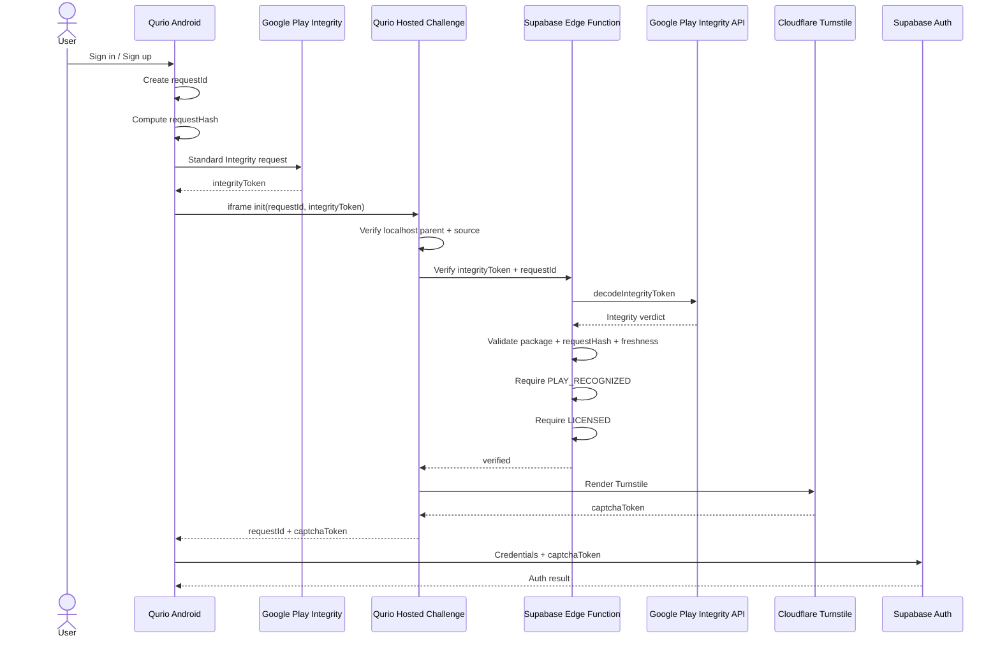

# Qurio — Future Android Play Integrity Upgrade

> **Status:** Deferred / future hardening  
> **Current decision:** Keep the existing Turnstile + hosted website challenge + Supabase Auth architecture for now.  
> **Android package ID:** `com.actionanand.qurio.app`  
> **Production website:** `https://actionanand.github.io/qurio`  
> **Hosted CAPTCHA challenge:** `https://actionanand.github.io/qurio/auth/challenge`

---

## 1. Why this document exists

Qurio already protects authentication with:

- Cloudflare Turnstile
- Supabase Auth
- email verification
- Qurio account approval/status rules
- Row Level Security (RLS)
- strict `postMessage` origin/source checks for the Android hosted CAPTCHA flow

This is sufficient for the current release.

The remaining Android-specific limitation is that the Capacitor app runs with the WebView origin:

```text
https://localhost
```

The hosted Qurio challenge currently trusts that origin when it receives the Android iframe initialization message.

That blocks ordinary websites such as:

```text
https://attacker.example
```

but `https://localhost` does **not** cryptographically prove that the caller is the genuine Qurio APK.

A different Android app could also create a WebView using `https://localhost`.

This document records the future hardening option so it can be implemented later without rediscovering the design.

---

# 2. Current architecture — keep this for now

The current Android CAPTCHA flow is:

```text
Qurio Android
https://localhost
        |
        | iframe
        v
https://actionanand.github.io/qurio/auth/challenge
        |
        | Cloudflare Turnstile
        v
captchaToken
        |
        | postMessage back to Android
        v
Qurio Android
        |
        | email + password + captchaToken
        v
Supabase Auth
```

The hosted challenge accepts initialization only from the configured Android WebView origin:

```text
https://localhost
```

The Android app accepts the CAPTCHA result only from:

```text
https://actionanand.github.io
```

with the expected:

- iframe source
- request ID
- non-empty CAPTCHA token

This remains useful and should be preserved even if Play Integrity is added later.

---

# 3. What the current design protects

The current design helps prevent:

- another normal website from directly using Qurio's hosted CAPTCHA flow
- arbitrary `postMessage` injection
- stale CAPTCHA responses
- CAPTCHA token reuse inside the normal Qurio flow
- login/signup without a CAPTCHA token when Supabase CAPTCHA protection is enabled
- access to protected Qurio data without normal Supabase/RLS authorization

It also keeps user credentials out of the hosted CAPTCHA page.

The website challenge receives only CAPTCHA-related data.

---

# 4. Remaining limitation

The remaining Android-specific limitation is:

```text
https://localhost
```

identifies a WebView origin.

It does **not** prove:

```text
"This is the official Qurio app from Google Play."
```

A different Android app may also be able to create a WebView that reports:

```text
https://localhost
```

and attempt the same iframe handshake.

That app still would not automatically get database access, because:

- it would still need valid user credentials
- Supabase authentication still applies
- Qurio approval/status rules still apply
- RLS still controls data access

But if future releases need stronger Android app identity, add **Google Play Integrity**.

---

# 5. Important distinction — website vs Android app

Qurio has two legitimate access channels.

## Web

```text
https://actionanand.github.io/qurio
```

This is intentionally a public web application.

Anyone can navigate to it using a normal browser.

The web security chain is:

```text
Qurio website
        |
        v
Cloudflare Turnstile
        |
        v
Supabase Auth
        |
        v
Qurio account rules
        |
        v
RLS
```

This should remain available even after Play Integrity is introduced.

---

## Android

The Android app is:

```text
com.actionanand.qurio.app
```

and is intended to be distributed through Google Play.

A future Android-specific security chain can become:

```text
Official Qurio Android app
        |
        v
Google Play Integrity
        |
        v
Qurio hosted challenge
        |
        v
Cloudflare Turnstile
        |
        v
Supabase Auth
        |
        v
Qurio account rules
        |
        v
RLS
```

Play Integrity should apply only to the Android-specific flow.

It should **not** be required for normal web users.

---

# 6. Package ID alone is not security

The package ID is:

```text
com.actionanand.qurio.app
```

This value is public.

Another developer can type the same package name into source code.

Therefore this alone is not sufficient:

```text
if packageName == "com.actionanand.qurio.app"
    allow()
```

The stronger check must be performed by Google and verified by a trusted backend.

What matters is that Google recognizes:

- the expected package
- the expected Play-distributed app/signing identity
- the user's Play entitlement

---

# 7. Future recommended solution — Google Play Integrity

When stronger Android identity is required, use the **Google Play Integrity API**.

The preferred future model is:

```text
Qurio Android
        |
        | Standard Play Integrity request
        v
Google Play
        |
        | signed/encrypted integrity token
        v
Qurio Android
        |
        | integrity token + requestId
        v
Supabase Edge Function
        |
        | server-side verification with Google
        v
Google Play Integrity API
        |
        | verdict
        v
Supabase Edge Function
        |
        | verified / rejected
        v
Hosted Qurio challenge
```

Only after the app passes Play Integrity should the Android hosted challenge render Turnstile.

---

# 8. Recommended baseline verdicts

For Qurio's "Play Store only" requirement, the future server-side baseline should require:

```text
requestDetails.requestPackageName == com.actionanand.qurio.app
```

and:

```text
appIntegrity.appRecognitionVerdict == PLAY_RECOGNIZED
```

and:

```text
appIntegrity.packageName == com.actionanand.qurio.app
```

and:

```text
accountDetails.appLicensingVerdict == LICENSED
```

In addition:

```text
requestHash must match the current Qurio request
```

and:

```text
the integrity token/request must be fresh
```

---

# 9. Why `PLAY_RECOGNIZED` matters

`PLAY_RECOGNIZED` provides evidence that Google recognizes the installed application as the Play-distributed Qurio app.

This is stronger than checking:

```text
https://localhost
```

or:

```text
com.actionanand.qurio.app
```

inside JavaScript.

The package value can be copied.

The Play-recognized app/signing identity cannot simply be reproduced by another developer.

---

# 10. Why `LICENSED` matters

Qurio is intended to be installed from Google Play.

The future server can therefore also require:

```text
LICENSED
```

This adds a Play entitlement requirement.

Conceptually:

```text
Correct Qurio app
+
recognized by Google Play
+
user has Play entitlement
=
allow Android CAPTCHA challenge
```

This is a good fit for Qurio's planned Play-Store-only distribution model.

---

# 11. Optional device integrity

Google Play Integrity can also return device integrity information.

A future stricter policy could require:

```text
MEETS_DEVICE_INTEGRITY
```

Do **not** make this mandatory automatically.

This is a separate policy decision.

The main goal of the future upgrade is:

```text
"Is this the genuine Play-recognized Qurio application?"
```

not:

```text
"Is this device completely uncompromised?"
```

Requiring device integrity may exclude some otherwise legitimate users.

So the recommended initial policy is:

```text
PLAY_RECOGNIZED     REQUIRED
LICENSED            REQUIRED
MEETS_DEVICE_INTEGRITY   OPTIONAL
```

---

# 12. Bind Play Integrity to the existing CAPTCHA request

Qurio already creates a random CAPTCHA request ID:

```text
requestId
```

The future Play Integrity request should be bound to that exact transaction.

Recommended canonical value:

```text
qurio:android-captcha:<requestId>
```

Example:

```text
qurio:android-captcha:54f91ac7-648a-4ae5-b260-74a04a85f659
```

Then compute:

```text
SHA-256(canonical value)
```

and use the result as the Play Integrity:

```text
requestHash
```

The server must independently recompute the same value.

It must not trust a `requestHash` supplied by the client.

---

# 13. Why requestHash is important

Without request binding, a valid Play Integrity token could potentially be copied into another authentication attempt.

With request binding:

```text
Play Integrity token
        |
        +-- bound to requestId A
```

cannot be accepted for:

```text
requestId B
```

The intended validation becomes:

```text
integrity proof belongs to this exact Qurio CAPTCHA transaction
```

---

# 14. Future Android flow

The future Android flow should be:

```text
1. User opens Qurio Android.

2. User starts login / registration / password reset.

3. Qurio creates:
   requestId = crypto.randomUUID()

4. Qurio creates:
   qurio:android-captcha:<requestId>

5. Qurio calculates SHA-256 requestHash.

6. Native Android requests a Standard Play Integrity token.

7. Android receives integrityToken.

8. Android initializes hosted Qurio challenge with:
   requestId
   integrityToken

9. Hosted challenge performs the existing checks:
   - correct hosted location
   - parent is expected window
   - parent origin is https://localhost
   - requestId is valid

10. Hosted challenge sends requestId + integrityToken to
    a Supabase Edge Function.

11. Supabase Edge Function sends integrityToken to Google
    for server-side decoding/verification.

12. Server validates:
    - package name
    - requestHash
    - freshness
    - PLAY_RECOGNIZED
    - LICENSED

13. Only if all required checks pass:
    hosted page renders Cloudflare Turnstile.

14. Cloudflare returns captchaToken.

15. Hosted page returns captchaToken to Android with the
    existing strict postMessage checks.

16. Android sends:
    email/password + captchaToken
    directly to Supabase Auth.

17. Supabase validates Turnstile server-side.

18. Existing Qurio approval/status/RLS rules continue.
```

---

# 15. Future architecture diagram



---

# 16. How the fake Android app would be blocked

Today, another Android WebView could potentially imitate:

```text
https://localhost
```

After Play Integrity:

```text
Fake Android app
        |
        | https://localhost
        v
Qurio hosted challenge
        |
        | requires Play Integrity proof
        v
Google verification
        |
        v
Not recognized as official Qurio app
        |
        v
REJECT
        |
        v
Turnstile is not rendered
```

Even if a fake app copies:

```text
com.actionanand.qurio.app
```

that does not make it the Play-recognized Qurio build.

---

# 17. Another app can still display the public Qurio website

This is expected and is **not** the same as impersonating Qurio Android.

Another Android application can potentially act like a browser and open:

```text
https://actionanand.github.io/qurio
```

as a top-level website.

That is simply access to Qurio's public web application.

The user must still authenticate normally.

Therefore:

```text
Fake app pretending to be Qurio native
→ future Play Integrity can block

Other app displaying the public Qurio website
→ possible, because Qurio Web is intentionally public
```

This is acceptable as long as the web application remains a supported Qurio access channel.

---

# 18. Play Integrity should gate the hosted Android challenge

A future implementation should **not** merely add:

```text
if integrityPassed()
```

inside Angular and then continue normally.

Client-side JavaScript can be modified.

The enforcement point must be server-side.

Recommended:

```text
Android
        |
        | integrityToken
        v
Hosted challenge
        |
        v
Supabase Edge Function
        |
        v
Google validation
        |
        v
verified
        |
        v
Turnstile rendered
```

If Play Integrity verification fails:

```text
do not render Turnstile
do not return captchaToken
```

---

# 19. Recommended backend

Qurio already uses Supabase.

Therefore the natural future backend is:

```text
Supabase Edge Function
```

Example future function:

```text
supabase/functions/android-integrity-verify/
```

Its job should be limited to:

```text
receive requestId + integrityToken
        |
        v
validate request
        |
        v
call Google Play Integrity API
        |
        v
validate verdict
        |
        v
return:
verified = true/false
```

Do not expose Google's full verdict to the browser unless needed.

---

# 20. Server-side secrets

Future Google authentication credentials must remain on the server.

Possible Supabase secret names:

```text
GOOGLE_PLAY_INTEGRITY_SERVICE_ACCOUNT_JSON
```

Optional certificate allowlist:

```text
PLAY_INTEGRITY_ALLOWED_CERT_SHA256
```

These are **secret values** and must never be stored in:

```text
environment.ts
environment.prod.ts
Angular code
Capacitor JavaScript
Git repository
GitHub Pages
```

---

# 21. Public values

These are not secrets:

```text
Package ID:
com.actionanand.qurio.app

Google Cloud project number:
<future value>

Website:
https://actionanand.github.io/qurio

Android WebView origin:
https://localhost
```

The Google Cloud project **number** may be embedded in Android configuration when required by the Play Integrity API.

Do not confuse a project number with service-account credentials.

---

# 22. Optional signing-certificate allowlist

Google's Play-recognized verdict already checks the Play-distributed application identity.

For additional defense in depth, the server may optionally validate the certificate digest returned in the integrity verdict.

The expected SHA-256 certificate fingerprint should come from the actual **Google Play App Signing** configuration.

Do not invent or guess this value.

If implemented:

```text
PLAY_INTEGRITY_ALLOWED_CERT_SHA256
```

can be stored as a server-side configuration/secret.

---

# 23. Expected manual setup when upgrading

When the upgrade is eventually implemented, perform these manual steps:

1. Open Google Play Console for Qurio.
2. Confirm the application ID:
   `com.actionanand.qurio.app`
3. Configure/link Play Integrity with a Google Cloud project.
4. Record the Google Cloud **project number**.
5. Enable/configure the Play Integrity API as required.
6. Configure a server identity/service account for verification.
7. Store the required credentials in Supabase secrets.
8. Optionally record the Google Play App Signing SHA-256 certificate digest.
9. Add the Play Integrity Android library.
10. Add the native bridge/API call.
11. Add the Supabase Edge Function.
12. Bind integrity verification to the existing `requestId`.
13. Gate Android Turnstile rendering on successful server verification.
14. Deploy the Edge Function.
15. Test using a Qurio build installed through a Google Play testing track.

---

# 24. Testing note

A normal locally built/sideloaded debug APK may not receive the same Play-recognized/licensed verdict as the Play-distributed build.

Therefore real end-to-end testing should use a Google Play-supported test distribution path, such as an internal testing track.

Do not weaken production verification merely to make a sideloaded debug APK pass.

Automated tests should mock Play Integrity responses.

---

# 25. Do not remove existing protections

When Play Integrity is added later, keep:

- `https://localhost` parent-origin validation
- exact `event.source` checks
- exact `postMessage` target origins
- random `requestId`
- iframe sandbox
- challenge timeout
- listener cleanup
- Cloudflare hostname restrictions
- Supabase CAPTCHA validation
- email verification
- account approval/status rules
- RLS

Play Integrity should be an **additional layer**, not a replacement.

---

# 26. Future security stack

After the upgrade, Qurio would use layered security.

## Website

```text
Official website hostname
        |
        v
Cloudflare Turnstile
        |
        v
Supabase Auth
        |
        v
Qurio account rules
        |
        v
RLS
```

## Android

```text
Official Play-distributed Qurio APK
        |
        v
Google Play Integrity
        |
        v
localhost / iframe origin checks
        |
        v
Cloudflare Turnstile
        |
        v
Supabase Auth
        |
        v
Qurio account rules
        |
        v
RLS
```

Each layer answers a different question:

| Layer                | Question                                               |
| -------------------- | ------------------------------------------------------ |
| Play Integrity       | Is this the genuine Play-recognized Qurio Android app? |
| `postMessage` checks | Is this message from the expected parent/frame/origin? |
| Turnstile            | Did the request pass the CAPTCHA/anti-bot challenge?   |
| Supabase Auth        | Is this user authenticated?                            |
| Qurio profile/status | Is this user allowed into Qurio?                       |
| RLS                  | Which rows/resources can this user access?             |

---

# 27. When to implement this upgrade

Play Integrity is worth adding when one or more of these become important:

- abuse of the Android-specific hosted CAPTCHA flow is observed
- only the official Play Store app should be allowed to use an Android-only API
- premium/licensed Android functionality is introduced
- server resources need stronger app-origin protection
- automated cloning/repackaging becomes a concern
- Android-specific privileged operations are added

For the current Qurio release, the existing architecture can remain unchanged.

---

# 28. Current decision

For now:

```text
KEEP CURRENT IMPLEMENTATION
```

Current security remains:

```text
Website:
Turnstile + Supabase Auth + account rules + RLS

Android:
hosted Qurio Turnstile iframe
+ strict postMessage validation
+ Supabase Auth
+ account rules
+ RLS
```

Future optional hardening:

```text
ADD GOOGLE PLAY INTEGRITY
```

before allowing Android to render the hosted Turnstile challenge.

---

# 29. Short reminder for future Anand

If revisiting this later, remember:

> The current weak point is **not Cloudflare** and **not the public Supabase key**. The remaining Android-specific gap is that `https://localhost` proves only a WebView origin, not the genuine Qurio APK. If stronger Android identity is needed, add **Google Play Integrity**, verify it on a **Supabase Edge Function**, require **PLAY_RECOGNIZED + LICENSED** for `com.actionanand.qurio.app`, bind the integrity request to the existing CAPTCHA `requestId`, and render Turnstile only after server-side verification succeeds.
